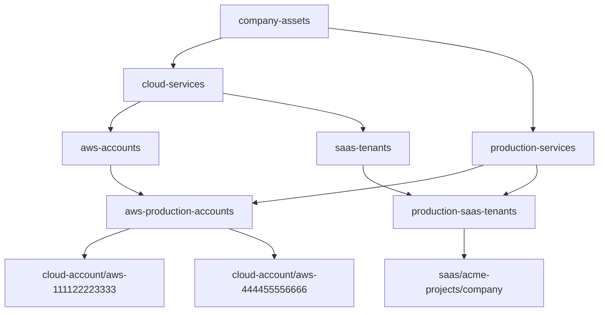

# Mock cloud and SaaS fleet

This example adds three synthetic governed subjects without contacting AWS or a
real SaaS provider:

- `cloud-account/aws-111122223333`, an AWS production account;
- `cloud-account/aws-444455556666`, a second AWS production account; and
- `saas/acme-projects/company`, a production tenant of the fictional
  **Acme Projects** SaaS application.

It demonstrates that inventory, policy resolution, evidence collection, and
OPA evaluation use the same contracts for an API-governed object as for the
local MacBook. No credentials, customer data, or real account identifiers are
present.

## Inventory DAG and assignments

Both subjects resolve through more than one branch of the group DAG:



| Group | Assigned baseline |
|---|---|
| `aws-production-accounts` | `company.aws-foundation@1`, `company.aws-s3-public-access@1` |
| `production-saas-tenants` | `company.saas-foundation@1` |

The example has its own project configuration at
[`compliance.yaml`](compliance.yaml). It assembles reusable controls and evidence/parameter
schemas from the co-located, independently named `control-library` source with
synthetic baselines from `verification-policy`. Neither source has precedence.
The validation registry registers it as `mock-fleet`, so operators can select
it without knowing the config path.

## External framework profiles and company policy

The upstream files are small, illustrative automation profiles mapped to
[CSA Cloud Controls Matrix v4.1](https://cloudsecurityalliance.org/artifacts/cloud-controls-matrix-v4-1):

- [`csa-ccm-aws-foundations-profile.json`](../../policy-sources/verification-policy/policies/baselines/upstream/csa-ccm-aws-foundations-profile.json)
- [`csa-ccm-saas-foundations-profile.json`](../../policy-sources/verification-policy/policies/baselines/upstream/csa-ccm-saas-foundations-profile.json)

They are intentionally **not** copies of the complete CCM, do not reproduce
CSA control text, and do not assert certification or complete framework
coverage. The `external_refs` are traceable mappings for policy review; they do
not make one technical check equivalent to an entire CCM objective or domain.

The company overlays pin those profiles and make the effective desired policy
explicit:

- [`company-aws-foundation.json`](../../policy-sources/verification-policy/policies/baselines/company/company-aws-foundation.json)
  tailors local searchable audit-log retention from 365 to 90 days under
  `DEV-AWS-001`, annotates the multi-Region trail remediation, and adds a
  company security-contact requirement.
- [`company-aws-s3-public-access.json`](../../policy-sources/verification-policy/policies/baselines/company/company-aws-s3-public-access.json)
  adds an independently attributable account-level S3 Block Public Access
  requirement mapped to
  [AWS Security Hub `S3.1`](https://docs.aws.amazon.com/securityhub/latest/userguide/s3-controls.html#s3-1).
  The same four desired
  booleans drive OPA assessment and remain explicit resolved parameters in the
  assessment plan.
- [`company-saas-foundation.json`](../../policy-sources/verification-policy/policies/baselines/company/company-saas-foundation.json)
  tailors in-product audit retention from 365 to 180 days under
  `DEV-SAAS-001`, annotates MFA remediation, and adds a company guest-access
  requirement.

Both retention deviations state that a separate external archive provides the
longer retention. This example checks only the local/in-product value; a real
deployment should add evidence and an independently attributable control for
the external archive rather than treating the rationale as proof.

## Mock collection and real API boundary

The files in [`fixtures/`](fixtures/) represent normalized responses from
read-only APIs. The policy-agnostic mock collector refreshes collection times,
uses payload-derived material only to construct its stable evidence ID, and
writes the common evidence envelope without a separate payload-integrity field:

```sh
uv run --project tooling python tooling/collectors/mock-api/collect.py \
  projects/mock-fleet/fixtures \
  projects/mock-fleet/generated/evidence
```

For real AWS collectors, the same payloads can be populated from calls such as
IAM `GetAccountSummary`, CloudTrail `DescribeTrails`, CloudWatch Logs
`DescribeLogGroups`, Account `GetAlternateContact`, and S3 Control
`GetPublicAccessBlock`. The fictional SaaS
fixture lists the settings endpoints that its real adapter would call. API
credentials and retry/rate-limit handling belong in collectors or integration
services; neither desired parameters nor OPA evaluation belong there.

The evidence schemas require only the compatibility core used by current
controls and preserve additional provider fields:

- [`aws-account-configuration-v1.schema.json`](../../policy-sources/control-library/policies/schemas/evidence/aws-account-configuration-v1.schema.json)
- [`aws-s3-account-public-access-block-v1.schema.json`](../../policy-sources/control-library/policies/schemas/evidence/aws-s3-account-public-access-block-v1.schema.json)
- [`saas-tenant-configuration-v1.schema.json`](../../policy-sources/control-library/policies/schemas/evidence/saas-tenant-configuration-v1.schema.json)

A shared evidence directory may contain documents for many subjects. The input
builder selects only documents whose `subject.id` matches the rendered plan,
then applies type and freshness requirements.

## Run the example

From the destination repository root:

```sh
scripts/dev cli --config projects/mock-fleet/compliance.yaml config validate
scripts/dev cli --config projects/mock-fleet/compliance.yaml inventory graph
scripts/dev cli --config projects/mock-fleet/compliance.yaml policy validate
scripts/dev cli --config projects/mock-fleet/compliance.yaml plan show

uv run --project tooling python tooling/collectors/mock-api/collect.py \
  projects/mock-fleet/fixtures \
  projects/mock-fleet/generated/evidence \
  --collected-at 2026-09-01T00:00:00Z

scripts/dev cli --config projects/mock-fleet/compliance.yaml \
  assessment run --all --at 2026-09-01T00:00:00Z

scripts/dev cli --config projects/mock-fleet/compliance.yaml assessment status \
  --plan projects/mock-fleet/generated/plans/cloud-account__aws-111122223333.json \
  --assessed-plans projects/mock-fleet/generated/plans --at 2026-09-01T00:00:00Z \
  --as-of 2026-09-01T00:00:00Z
scripts/dev cli --config projects/mock-fleet/compliance.yaml assessment mappings \
  --plan projects/mock-fleet/generated/plans/cloud-account__aws-111122223333.json \
  --assessed-plans projects/mock-fleet/generated/plans --at 2026-09-01T00:00:00Z \
  --as-of 2026-09-01T00:00:00Z
scripts/dev cli --config projects/mock-fleet/compliance.yaml \
  assessment explain cloud-account/aws-111122223333 \
  --plan projects/mock-fleet/generated/plans/cloud-account__aws-111122223333.json \
  --assessed-plans projects/mock-fleet/generated/plans --at 2026-09-01T00:00:00Z \
  --as-of 2026-09-01T00:00:00Z
```

## Assessment-plan handoff

Both AWS subjects receive the ordinary foundation and account-level S3 public-access
baselines. Their resolved assessment plans retain subject and plan identity, named
policy-source content digests, stable control instance and implementation IDs,
resolved S3 parameters, definition fingerprints, lineage, deviations, and policy
source provenance. This is the complete handoff for a separately implemented
external adapter; assessment does not require one to be installed.

The second account remains intentionally useful because its observations satisfy
all five assigned controls. Alongside the drifting first account, it proves
subject-scoped evidence selection, pass and fail outcomes, shared DAG membership,
and framework filtering across two AWS subjects.

Running from this example directory discovers its local project config, so the
same commands work there without `--project mock-fleet`.

The policy gate validates every reusable control manifest, its local parameter
schema, and the effective parameters produced by the company overlays.

The extensionless configured `plan` and `results` paths are per-subject
directories. The CLI writes stable filenames derived from each subject ID, so
the two runs build a fleet view without output flags. This is the same layout
used by the single-subject MacBook project and is formalized in
[`project-layout.md`](../../tooling/docs/project-layout.md).

With multiple generated plans, `plan show` renders a fleet index. Pass a
subject ID, such as `plan show cloud-account/aws-111122223333`, to inspect one
complete plan; an explicit plan-file path remains supported.

## Intentional development drift

The fixtures intentionally produce useful mixed results:

| Subject | Pass | Fail | Intended failures |
|---|---:|---:|---|
| AWS account | 2 | 3 | multi-Region CloudTrail; security contact; S3 public-access block |
| Second AWS account | 5 | 0 | none; retained as the passing cloud and filter case |
| SaaS tenant | 3 | 1 | MFA enforcement |

Changing a fixture and recollecting simulates drift from an external system.
Changing an upstream profile invalidates stale overlay pins or fingerprints,
forcing company policy authors to review the rebase.

The mapping view shows each CSA CCM reference, asset, technical result,
and alignment. The two local-retention checks appear as `TAILORED`: their pass
or fail status is against effective company policy and must not be read as
unaltered CSA CCM conformance.

Generated evidence, plans, and results live below `generated/` and should not
be committed.

The `project-config/v1alpha3` configuration uses executing tooling’s inventory and
assignment schemas. Assessment plans/results use v4 actual composition, evaluator,
and evidence provenance; generated state remains local to this project.
