# OPA Compliance Toolset — Architecture

Status: **Working draft (v0.1)**  
Last updated: **2026-09-06**

This document is a shared design surface, not a finished specification. It
records our current model, the reasoning behind it, and the questions that
still need decisions.

## 1. Intent

Build a self-hosted compliance toolset that turns human-readable controls into
testable, versioned policy; evaluates typed JSON evidence consistently with
Open Policy Agent (OPA); and produces results that people can understand,
review, and audit. Policy evaluation remains off the governed object.

The toolset should answer four different questions without conflating them:

1. **What should be true?** — controls and policy intent.
2. **Is it true now?** — evaluation against typed evidence.
3. **What happened?** — durable evidence, findings, and decision history.
4. **What happens next?** — enforcement, remediation, or an approved exception.

## 2. Initial design principles

- **OPA decides; it does not collect or orchestrate.** Rego evaluates supplied input and
  data. Collection, scheduling, workflow, storage, and remediation belong
  outside the policy engine.
- **Governed objects do not carry policy.** An on-host component may collect
  evidence, but policy distribution and evaluation happen elsewhere.
- **One control model, multiple enforcement points.** The same control intent
  may be checked in CI, at admission time, and continuously, while adapters
  supply context appropriate to each point.
- **Policy and evidence are versioned together.** A result is only reproducible
  when it identifies the policy bundle, input snapshot or digest, data
  dependencies, evaluator version, and evaluation time.
- **Observations are separated from conclusions.** Collectors produce typed
  evidence; policies produce decisions; the platform turns decisions into findings.
- **Inventory is a projection, not a source of truth.** External systems retain
  authority for governed-subject identity, lifecycle, ownership, and source
  metadata. The compliance platform normalizes and revisions imported views
  only to calculate policy scope and explain assessments.
- **Canonical inventory resources use Kubernetes conventions.** Versioned,
  typed YAML/JSON objects use `apiVersion`, `kind`, `metadata`, labels,
  annotations, selectors, and explicit references. This convention does not
  require a Kubernetes cluster; source-specific formats such as Ansible
  inventory can be translated by adapters.
- **Explainability is part of the policy contract.** A denial alone is not a
  useful compliance result. Decisions should include control identity, reason,
  affected resource, severity, and remediation guidance.
- **Exceptions are explicit data.** Waivers are scoped, attributable, expiring,
  and auditable—not comments embedded in policy.
- **Frameworks map to controls; they do not duplicate logic.** A reusable
  technical control can map to several framework requirements such as ISO 27001,
  SOC 2, PCI DSS, or an internal standard. Company policy and operational
  concerns may also exist without any external mapping. When external wording
  is broad, a reviewed company interpretation and complete realization bridge
  it to attributable checks; the framework prose is not executable policy.
- **Verification is scenario-first and claim-aware.** Stable verification
  projects use deterministic, real-world-shaped synthetic situations and map
  implemented features onto those stories. They expose the complete path from
  an internal or external concern through company intent, operating practice, technical
  realization, evidence, results, and exceptions without turning mapped checks
  into unsupported framework-conformance claims.
- **Technical policy does not require a regulatory wrapper.** Concrete package,
  hardening, and application-configuration baselines remain useful on their
  own. High-level requirements and realizations are added only when a complete
  objective-level assurance claim is needed; a subject may receive both kinds
  of policy in one rendered plan.
- **One operator CLI, separate runtime responsibilities.** Inventory, planning,
  evaluation, and reporting share a discoverable command surface and project
  configuration through the sole supported `compliance` operator entry point
  while remaining separate internal modules. Those module paths are not a
  public Python API. Collectors remain external processes connected through
  typed evidence documents.
- **Current operator views follow Inventory → Coverage → Assessment.**
  Inventory presents supplied normalized facts. Coverage is an ephemeral query
  projection over the existing membership, assignment, policy-resolution,
  planning, adoption, and disposition owners. Assessment remains the historical
  result concern. Coverage has no resource, persistence, identity, cache,
  artifact, or alternate resolution algorithm.
- **Assessment plans are the interoperability boundary.** A resolved technical
  control retains stable identity, parameters, fingerprint, lineage, and
  provenance in the assessment plan. Separately implemented programs may map
  that plan into backend-specific output; core tooling neither loads those
  programs nor treats their output as execution or evidence.

## 3. Proposed system shape

```mermaid
flowchart LR
    IS[External inventory sources] --> IP[Inventory adapters and projection]
    IP --> H[Groups and baseline assignments]
    S[Governed systems and APIs] --> C[Evidence collectors and adapters]
    C --> F[Typed JSON evidence]
    F --> ES[Evidence store]
    ES --> E[Evaluation service / OPA]
    P[Policy source] --> B[Build, test, sign policy release]
    B --> E
    H --> AP[Resolved assessment plan]
    B --> AP
    AP --> E
    W[Waivers] --> E
    E --> R[Decision results]
    R --> X[Report and findings service]
    ES --> X
    X --> A[API, UI, reports, exports]
    X --> N[Notifications and workflow]
    AP -. external handoff .-> XA[External IaC, PaC, MDM, ticketing, or configuration program]
    XA -. separately approved execution .-> S
```



This separates two broad areas:

### Collection plane

Source-specific collectors observe governed objects and emit typed JSON
evidence. A collector may run as an endpoint agent, over SSH, as an API client,
or in an integration service. It knows how to observe state, but it does not
contain compliance policy or decide whether that state is acceptable.

### Inventory projection plane

Source adapters ingest inventory from systems such as Ansible, CMDBs, service
catalogs, cloud APIs, and static reviewed files. The platform normalizes those
records into subjects, retains source identity and snapshot provenance, and
calculates group membership for policy resolution. It is a read-only consumer:
the upstream systems remain authoritative, and inventory ingestion does not
write lifecycle, ownership, labels, or configuration back to them.

An eventual immutable source snapshot is a separate ingestion/provenance concern,
not a current assessment identity or artifact. Historical assessment reproduction
uses the operation's mode-sensitive frozen selection and resolution facts. The
platform is authoritative only for its own concerns, including group rules, policy
assignments, policies, rendered plans, decisions, and findings.

### Evaluation plane

The evaluator resolves a subject's groups and baseline assignments, assembles
the relevant evidence, and evaluates a pinned policy bundle in OPA. Evaluators
are hosted away from governed objects and can scale independently.

### Reporting plane

The reporting service consumes immutable decisions and evidence references. It
maintains finding lifecycles, history, dashboards, notifications, exports, and
audit views. It does not recalculate policy outcomes.

System [ADR 0011](../../docs/adr/0011-historical-assessment-and-operational-evidence-timeliness.md) owns immutable historical outcomes, exact operation-bound plan alignment and query-time operational evidence timeliness. #80 implements its derived historical view and separate dimension aggregation. A historical result never ages into another logical outcome; only support from its exact selected evidence and recorded waiver interval receives temporal qualification. #90 retains the validated identity-bound selection/temporal facts in current v4. See [artifact provenance](artifact-provenance.md#exact-planresult-contract) and [CLI behavior](cli.md#historical-results-and-operational-views).

### Policy management plane

Git-backed policy, control metadata, evidence schemas, baselines, and tests are
built into immutable policy releases. A release contains the OPA bundle plus a
compiled catalog and schemas used by the assessment planner. Promotion and
rollback are independent of collector and reporting releases.

A deployed environment may assemble several named releases or partial policy
trees locally. Source order has no precedence: identical identities coalesce
with provenance and divergent identities fail. The plan retains actual named
source content once in its ADR 0007 planning composition. This lets a restricted
environment combine verified shared policy with private overlays or complete
realizations without exposing those details to central CI.

### External adapter boundary

Core tooling ends at resolved desired technical controls plus evidence-backed
assessment. The provenance-bearing assessment plan exposes subject, operation,
member-plan and bound-plan identity, actual planning composition, stable
`implementation` and `instance_id`, resolved `parameters`,
`definition_fingerprint`, disposition, derivations, deviations, source and
baseline lineage, and requirement/realization lineage where applicable.

External programs may consume the complete plan to map those records into IaC,
PaC, MDM, ticketing, configuration-management, or similar outputs. Core does
not load executable adapters or templates from policy sources and assessment
does not require an adapter. External output is neither proof of execution nor
compliance evidence. If it records provenance, it references the source
assessment plan.

## 4. Core domain model

| Concept | Meaning |
|---|---|
| **Asset** | A resource in scope: repository, cluster, cloud account, workload, identity, etc. |
| **Inventory projection** | A normalized supplied view of subjects and policy-selecting metadata imported from external authorities; it is not an assessment-wide snapshot identity. |
| **Evidence document** | A typed JSON observation about a subject, with provenance, collection time, and freshness. |
| **Control requirement** | A technology-neutral company outcome that may map to an external framework objective. |
| **Control implementation** | Reusable Rego that evaluates one technical condition against a particular evidence contract. |
| **Control instance** | A stable, parameterized technical desired-state check supplied directly by a baseline or by a requirement realization. |
| **Control realization** | The complete environment-specific set of technical instances and satisfaction rule used to assess one control requirement. |
| **Framework requirement** | An external or internal requirement mapped to one or more controls. |
| **Decision** | The immutable output of one policy evaluation. |
| **Finding** | A tracked compliance issue derived from one or more failing decisions. |
| **Group** | A node in the subject-group DAG, populated by explicit membership or selectors. |
| **Policy assignment** | A mapping from a stable inventory group to one or more baselines. |
| **Baseline** | A named set of parameterized control instances. |
| **Assessment plan** | The fully resolved, immutable policy to evaluate for one subject. |
| **External adapter** | A separate program that may consume an assessment plan and owns its own backend mapping, output, credentials, state, approval, and execution semantics. |
| **Evidence** | Material supporting a result: observations, decision metadata, references, or artifacts. |
| **Waiver** | A time-bounded, approved exception with scope, owner, and rationale. |
| **Remediation** | Guidance or an action intended to resolve a finding. |

An important boundary: a **decision** is an event, while a **finding** has a
lifecycle. Repeated failed evaluations should update or corroborate a finding,
not create endless duplicate tickets.

## 5. Policy contract

Each policy package should expose a predictable result shape. Exact naming is
still open, but the semantic contract should resemble:

```json
{
  "control_id": "access.mfa.required",
  "resource": {
    "type": "identity",
    "id": "user/123"
  },
  "status": "fail",
  "severity": "high",
  "reason": "Interactive administrator account does not require MFA",
  "remediation": "Require phishing-resistant MFA for the account",
  "evidence_refs": ["evidence://identity/user-123/authentication"],
  "metadata": {
    "policy_version": "sha256:...",
    "input_schema_version": "identity/v1"
  }
}
```

Candidate status values are `pass`, `fail`, `unknown`, `not_applicable`,
`error`, and `waived`. Treating missing or stale data as `unknown` avoids
accidentally reporting absence of evidence as compliance. A valid waiver must
remain distinguishable from a pass.

## 6. Principal workflows

### Policy lifecycle

1. Author a control and its Rego implementation.
2. Validate control manifests, implementation parameter schemas, baselines, and
   overlays; resolve inheritance and validate each effective control instance.
3. Build an immutable bundle and produce provenance.
4. Promote the bundle through environments.
5. Distribute it to evaluation points with rollback support.

### Continuous assessment

1. Discover subjects and collect source-specific observations.
2. Validate observations against versioned evidence schemas.
3. Resolve the group DAG and baseline assignments into an assessment plan.
4. Validate the rendered plan's strict schema, member/operation identity,
   derived accounting disposition, and provenance invariants.
5. Resolve active waivers and evaluate the plan's controls.
6. Validate and persist the decision envelope and evidence references.
7. Open, update, suppress, or close findings based on state transitions.

### External adaptation

1. Resolve inventory, assignments, baselines, overlays, and realizations once
   into the immutable assessment plan.
2. Persist and validate that provenance-bearing plan.
3. Let a separately installed program consume the plan and map stable control
   IDs, fingerprints, parameters, and provenance into its own output.
4. Keep backend capability, conflict, credential, state, approval, and
   execution semantics outside core tooling.
5. Collect fresh actual-state evidence independently and evaluate it with OPA.

External-framework reporting preserves two different claims. An objective
mapping reports the rolled-up result of a complete `ControlRequirement` and its
selected realization. A technical mapping reports only the independently
attributable check and its alignment to the mapped parent. Tailored or excluded
checks remain explicit; passing effective company policy does not silently
assert unaltered framework conformance.

An assurance explanation also needs to connect those policy objects to the
organization's intended way of working. The operating-practice narrative says
how people, platforms, ownership, approvals, and change workflows are expected
to implement the company objective. It does not become evidence merely because
it is documented. Procedural behavior that must affect an automated objective
result requires an appropriate evidence contract and independently
attributable check; otherwise it remains an explicit assurance gap.

Internal and external concerns converge on company-owned policy rather than
forming competing top-level hierarchies:

```text
Internal concern -> company objective or technical baseline
External requirement -> reviewed company interpretation -> company objective
Company objective -> realization -> technical controls
Technical controls -> optional external adaptation and delivery
Technical controls -> observed evidence and assessment
```

A company baseline can therefore be assigned widely for its own operational
value and also carry technical mappings that support several external
requirements. A company `ControlRequirement` can exist with no external
reference, or it can be the reviewed interpretation of one or more external
requirements. The same external reference may need several company objectives.
Mappings are many-to-many reporting relationships; they do not impose policy
precedence, copy vague framework prose into Rego, or implicitly merge control
parameters.

For a technically realized objective, the immutable plan explains the resolved
implementation contract, while evidence and results explain what was concluded
at the recorded assessment instant. Evidence within recorded age limits does not
establish present-state certainty under ADR 0011. External generated or applied output is not
proof by itself. Portions of a requirement concerning
governance, people, or process need appropriate attributable evidence and
checks or must remain visible as unverified rather than being inferred from a
host setting.

Whole-framework fulfillment is broader than either mapping level. It requires
a versioned framework and declared scope, complete accounting for applicable,
omitted, and approved not-applicable requirements, and defensible results for
every required objective. A small profile or a set of passing mapped controls
cannot by itself establish certification, legal compliance, or complete
framework conformance. See
[`verification-scenarios.md`](verification-scenarios.md) for the accepted
scenario and assurance-narrative rules.

Technical baselines and requirement baselines are complementary entry points
to the same plan and evaluator. A subject can have direct technical controls,
realized objectives, or both. Direct technical controls report desired-state
compliance without manufacturing a parent objective. Realized objectives add a
reviewed completeness assertion and conservative roll-up over their technical
results. Only the latter can produce an objective or requirement-baseline tick;
neither automatically constitutes certification or a legal conclusion.

## 7. Repository boundaries

Repository topology is governed by destination [ADR 0005](../../docs/adr/0005-content-addressed-development-boundaries.md), the current system [architecture](../../docs/ARCHITECTURE.md), and [repository map](../../docs/REPOSITORIES.md). Repository names, checkout paths, commits, and acquisition metadata are not canonical semantic or runtime identity.

Logical boundaries remain explicit across any source layout. Tooling, each
named policy source, release units, verification scenarios, and independently
operable projects retain distinct ownership and identity. Co-locating
non-sensitive development source does not merge policy-source catalogs,
invent source precedence, or combine project inventories and artifacts.

Real need-to-know boundaries remain physically and operationally separate. A
private environment owns its inventory, assignments, waivers, private policy,
collector configuration, credentials, and runtime locations. Branches and
ordinary source-directory boundaries are not access controls. Environment-local
assembly combines verified shared policy with private inputs without granting a
central source or CI context access to restricted material.

After inputs are materialized, evaluation must not require `.git`, submodule
commands, mutable branch lookups, repository coordinates, or hosted-provider
access. Content-addressed policy sources, exact distribution bytes, evaluator
identity, evidence identity, release composition, and generated-artifact
provenance remain the authoritative identities.

Each independently operable project follows the canonical layout in
[`project-layout.md`](project-layout.md). Authored inventory and assignments
are kept apart from generated evidence, per-subject plans, and per-subject
results. Project configuration declares the complete path contract, while
named policy catalogs and schemas remain independently identified and versioned
logical dependencies regardless of source placement.

## 8. Trust and security boundaries

- Authenticate collectors and evaluation clients; authorize them by tenant,
  environment, and asset scope.
- Authenticate evidence provenance so an asset cannot submit observations on
  behalf of an unrelated asset.
- Sign policy bundles and verify them before activation.
- Make evidence append-oriented and integrity-verifiable.
- Record provenance for facts and reference data.
- Preserve the external source, source object identity, observation time, and
  adapter revision for imported inventory attributes; do not silently resolve
  conflicting authoritative values by ingestion order.
- Minimize sensitive data in OPA input and decision logs; apply field-level
  redaction before persistence.
- Separate policy-authoring authority from waiver-approval authority.
- Define fail-open versus fail-closed behavior per enforcement point, never as
  a platform-wide accidental default.

## 9. Decisions we should make next

### A. End-to-end control families

The deterministic mock API collector normalizes provider responses into
domain-specific evidence without carrying desired policy. Typed macOS evidence
schemas, controls, and synthetic fixtures retain the platform-neutral evidence
and evaluation contracts without an active real-host collector. A future
host-observation path requires a concrete deployment owner and privacy boundary.
The IAM project proves a Linux host requirement realized through package,
identity-domain, SSH, and account evidence.

Dedicated verification should migrate toward stable, scenario-first projects
that remain deterministic while representing credible operational contexts.
Development projects remain free to discover new behavior, and boundary
examples remain separate where host state, privacy, private policy, or
repository isolation is the property being demonstrated. Several logical
projects may share one repository when ownership and visibility match, but
their inventories and generated artifacts must remain isolated. The accepted
direction and proposed migration are defined in
[`verification-scenarios.md`](verification-scenarios.md).

### B. Policy execution granularity

The effective policy is always rendered from the group DAG into an immutable
assessment plan, and results remain attributable to individual controls. We
will prototype whether OPA should receive one control or the complete plan per
evaluation call. The current proposal is described in
[`policy-model.md`](policy-model.md).

Inventory ownership, group membership, assignment binding, and deterministic
resolution are detailed in
[`inventory-and-assignments.md`](inventory-and-assignments.md).

### C. Evaluation trigger

Choose whether evidence arrival triggers evaluation, a scheduler evaluates the
latest evidence, or both. This choice affects how we express a complete
assessment across evidence collected at different times.

### D. Policy ownership model

Choose between centrally curated policy, team-owned policy with guardrails, or
a layered model where organizational baselines and local additions compose.

### E. Evidence retention and freshness

Assessment-time stale or absent required evidence produces `unknown`, not `pass`,
under ADR 0010. [ADR 0011](../../docs/adr/0011-historical-assessment-and-operational-evidence-timeliness.md) separately defines query-time
timeliness without changing historical results or existing freshness eligibility.
#32 retains the required factual temporal provenance; deriving timeliness must
not depend on long-term evidence-byte retention. Evidence storage/retention design
remains outside that decision.

### F. High-level requirements and private technical realizations

External mappings on technical checks provide traceability but do not prove
that an environment has completely implemented a higher-level objective. The
implemented initial contract in
[`control-realization.md`](control-realization.md) adds a
technology-neutral `ControlRequirement`, an environment-private
`ControlRealization`, and an explicit satisfaction rule. This lets a local
deployment calculate a defensible parent and requirement-baseline result while
keeping technical implementation details inside a need-to-know boundary.

The executable flow uses complete shared and restricted realizations,
an `allOf` rule over embedded technical instances, trusted-label exactly-one
selection, and an optional non-inheriting `based_on` provenance pin. It has no
template/binding layer or automatic realization merge. Policy validation checks
the complete catalog, the planner selects exactly one realization and freezes
its expanded checks into the subject plan, and local evaluation rolls technical
results into requirement and requirement-baseline results.

### G. External adaptation from resolved controls

The assessment plan is sufficient for an external program to distinguish
multiple instances of one implementation, resolved parameter differences,
control-definition drift, active versus excluded disposition, overlay
derivations and deviations, source/baseline lineage, and
requirement/realization lineage. Core creates no duplicate configuration-plan
artifact.

An external adapter owns mapping those records to backend output and all
backend capability, composition, conflict, credential, state, approval, and
execution behavior. Policy sources provide data and control parameter schemas,
not executable adapter code. Assessment remains complete without an adapter
installed.

### H. Operational personas, feature policy, and waivers

The Linux hardening rollout owned by the current verification integration source
exercises servers whose approved persona or feature requires a deliberate
hardening difference. A trusted inventory label selects a stable group and
reviewed derived baseline.
A durable persona-wide change to desired policy is an overlay deviation; a
temporary inability of one scoped subject to meet that effective policy uses a
project-owned waiver. The initial contract targets one exact subject and
technical control, validates approval and bounded lifecycle data, rejects
overlapping windows, and converts only an underlying failure to the distinct
`waived` result. The result snapshots the approval and original failure while
desired policy remains unchanged.

The same scenario assigns the company identity/access objective and selects the
complete shared Linux realization. One subject proves the objective from fresh
technical evidence; another has no access evidence and remains `unknown` while
its separate audit-package failure is waived. This demonstrates that company
operations policy, optional external objective mapping, resolved desired
controls, actual-state evidence, and exceptions can overlap without
collapsing their claims. See [`verification-scenarios.md`](verification-scenarios.md)
and [`waivers.md`](waivers.md).

## 10. Working assumptions (not decisions)

- Continue exercising several evidence domains rather than designing a
  universal provider configuration schema.
- Rego remains the executable policy language; higher-level authoring can be
  considered later if real users struggle with it.
- Policies are stored in Git and delivered as immutable bundles.
- The control plane stores decision metadata and evidence references; large raw
  artifacts may live in an object store.
- Evaluation is service-hosted and never runs on the governed object.
- External adaptation and execution remain separate from assessment authority.
  Any future delivery workflow must preserve approval and post-change
  verification boundaries.

## 11. Decision log

### 2026-09-09 — Current inventory and coverage operator views (#104)

The operator sequence is `Inventory → Coverage → Assessment`. Inventory
presents supplied normalized asset/group/assignment facts and membership
attribution. Coverage is a purpose-specific, ephemeral table/JSON projection
that calls the existing planner and accounting-disposition owner; it has no
resource, artifact, persistence, identity, cache, evidence selection, or second
applicability algorithm. Its five current expectation classes remain
`result_required`, `inactive`, `unassigned`, `no_assessable_policy`, and
`invalid_resolution`. CLI `asset` vocabulary does not rename `Subject` wire or
domain contracts. Assessment/history redesign remains outside this change.

### 2026-09-06 — Exact bound-plan/result historical pair (#90)

Implemented under #90: replace the duplicated self-contained result
with an explicit exact bound-plan/result pair. The plan owns resolved intent,
operation context, planning composition/enforcement, parameters, dependencies and
mappings; the result owns immutable conclusions, actual evaluation composition and
evaluation enforcement, evaluator, evidence snapshot/selections, compact outcomes,
and exact applied-waiver facts. Whole-catalog waiver revision and unrelated waivers
do not enter result identity. Intrinsic result validation is distinct from mandatory
plan/result relational validation. Historical plan resolution uses exact `plan_id`
from bounded input, without a new history/run/discovery system or compatibility path.
The runtime/schema cutover remains experimental and is not frozen.

### 2026-09-06 — Frozen operation and bound-plan identity simplification (#87)

The pre-freeze operation representation now uses one exact normalized request,
a mode-sensitive selection witness, relevant assignments, a compact ADR 0007
composition commitment, compact expected membership, and sorted member-plan
commitments. Catalog-wide inventory/assignment revisions and the predecessor
plan digest wrappers are removed. Each bound plan ID derives only from operation
ID and subject ID. Accounting disposition is derived rather than frozen as
coverage counters. No compatibility alias, inventory snapshot artifact, result
redesign, evidence/composition identity change or freeze is introduced.

### 2026-09-06 — Frozen operation accounting and typed assertions (#78)

The [operation contract](operation-accounting.md) specifies the embedded frozen
projection, exact-set historical reporting and concrete typed assertion examples.
Every selected Subject has an accounting row; only assessable members require
results. Operation context changes enclosing plan/result identity. One assessment
instant applies to all evaluated members. This implements ADR 0016 without another
artifact family, certificate subsystem, common-assurance engine or result graph.
ADR 0010/0012 and existing explicit N/A, missing realization and waivers are unchanged.

Earlier promotion entries below record their historical stage; #78 is the current
bounded implementation and #37 remains the escalation route.


### 2026-09-05 — Explicit parameter and freshness implementation (#73)

[Policy parameters](policy-parameters.md) specifies pinned declarations, explicit
binding and parameter-only derivation, direct dependency consumption, policy-owned
freshness and frozen artifact validation. Existing v4 plans/results carry the
additional identity-bearing facts; historical artifacts require historical tooling.
ADR 0010/0011 behavior is unchanged. The then-current ADR 0013–0015 design was subsequently superseded by ADR 0016 below.


### 2026-09-06 — Closed-world assessment replaces ADRs 0013–0015 (#37)

System [ADR 0016](../../docs/adr/0016-closed-world-policy-assessment.md) supersedes
the 2026-09-05 scoped-assurance/applicability/recognition design and migration route.
It is implemented experimentally under #78 and simplified under #87. Tooling retains Subject/group DAG/
assignment resolution, exact governed policy instances, every applicable path,
deterministic conflicts, typed evidence qualification and immutable results.
Future run accounting must detect omissions from the exact expected assessment set
of the supplied operation, without a new inventory hierarchy or chosen wire family.

The core assesses supplied company policy, not external inventory exhaustiveness,
external obligation-universe completeness, legal applicability authority, recognition
or independent external conformity. Governance owns those judgments. Mappings are
attributable policy/reporting content; results must remain bounded to supplied and
resolved company targets. Provenance identifies inputs, not their truth or authority.

Required assurance dependencies identify evidence contracts. Certificate fields are
contract-specific, never universal. Common assurance needs an explicit named beneficiary
dependency and attributable source assurance plus required correlation/integration
evidence; typed evidence may suffice. Direct assessment-result consumption is not
required and needs separate review if later found necessary.

Preserve ADR 0010 unknown/error/refusal, ADR 0012 parameters/direct consumption and
freshness, exactly-one design-time realization selection, missing-realization failure,
conservative roll-up and fail-only waivers. Unassigned is not automatic N/A; existing
explicit N/A remains distinct. Invalid required resolution cannot become a partial
valid plan or synthetic evidence unknown.

#73 is complete. #37 next permits narrow read-only exploration of expected run
accounting, typed external/procedural assurance dependencies and qualification,
beneficiary attribution and whether common reuse is needed. No runtime/schema/fixture
change or wire/algorithm freeze is authorized; ADR 0016 owns escalation and examples.

### 2026-09-05 — Explicit policy parameters and policy-owned freshness (#37)

System [ADR 0012](../../docs/adr/0012-explicit-policy-parameter-resolution.md)
accepts explicit binding and descendant tailoring, stable requirement slots,
direct typed realization-dependency consumption and policy-owned effective
`max_age`. Required unresolved or conflicting parameters prevent an assessable
plan; evaluation consumes already resolved values. Exact resolved implementation
inputs remain distinct from semantic requirement slots. Immutable plan facts
retain values, pins, operations, links, destinations and freshness provenance.
The bounded migration is [#73](https://github.com/packetlss/compliance/issues/73).
Current literal-input schemas and Control-owned ages remain executable until
that cutover; no runtime behavior changes in this documentation promotion.
ADR 0010/0011 evidence semantics and missing-realization behavior are preserved.

### 2026-09-05 — Predecessor retirement (#33)

After #31/#32 and destination cutovers #34–#36, current tooling accepts only
project-config v1alpha3, composition-lock v1alpha1 and assessment plan/results v4.
Delete predecessor schemas/readers/digests/dispatch and compatibility fixtures;
reproduce historical artifacts with historical tooling. V4 domain validation and
construction are native, retaining the existing semantic identity projections,
actual composition, ADR 0010/0011 evidence behavior and adapter handoff.


Substantial choices should become Architecture Decision Records under
`docs/adr/`. Until then, proposed choices remain in this document and are
explicitly labelled as assumptions.

The 2026-08-28 configuration compiler and renderer rows below are retained as
historical prototype decisions. They are superseded by the 2026-09-04 product
boundary: core ends at the assessment plan, configuration artifact families
and commands are unsupported, and adaptation is external.

| Date | Decision | Status |
|---|---|---|
| 2026-08-23 | Keep policy and evaluation off governed objects | Accepted |
| 2026-08-23 | Separate collection, evaluation, and reporting | Accepted |
| 2026-08-23 | Accept arbitrary JSON through explicit versioned evidence types | Accepted |
| 2026-08-23 | Model hierarchy as a DAG with group-level baseline assignments | Accepted |
| 2026-08-23 | Render an immutable effective assessment plan for each subject | Accepted |
| 2026-08-23 | Keep evidence schemas minimal and open to additional fields | Accepted |
| 2026-08-23 | Produce independently attributable results per control | Accepted |
| 2026-08-23 | Do not implicitly merge parameters across control instances | Accepted |
| 2026-08-23 | Choose per-control versus whole-plan OPA calls after prototyping | Proposed |
| 2026-08-23 | Start with a Linux baseline and validate with a SaaS control | Superseded by the implemented macOS, AWS, SaaS, and Linux IAM prototypes; the original local-Mac boundary project is now retired |
| 2026-08-23 | Model evaluation decisions separately from findings | Proposed |
| 2026-08-23 | Declare evidence dependencies in control manifests | Accepted |
| 2026-08-23 | Build OPA bundle, catalog, and schemas as one policy release | Proposed |
| 2026-08-23 | Keep group definitions and assignments in Git; resolve membership from inventory | Proposed |
| 2026-08-23 | Derive company policy through explicit overlays on immutable baselines | Accepted |
| 2026-08-23 | Keep company compliance separate from parent benchmark alignment | Accepted and exposed in framework mapping views |
| 2026-08-23 | Target assignments at stable groups; use singleton groups for one asset | Proposed |
| 2026-08-23 | Version inventory, assignments, and policy independently in each plan | Proposed |
| 2026-08-23 | Treat policy-selecting inventory labels as authoritative data | Proposed |
| 2026-08-23 | Treat subject inventory as a read-only projection, not a source of truth | Accepted |
| 2026-08-23 | Use Kubernetes resource conventions for canonical inventory authoring | Accepted |
| 2026-08-23 | Use one-resource-per-file for Git collaboration and multi-document YAML for importer streams | Accepted |
| 2026-08-23 | Model resolution, assessment coverage, and evaluation outcome as separate dimensions | Accepted |
| 2026-08-23 | Require assigned, active policy with at least one control before evaluation | Accepted |
| 2026-08-23 | Aggregate status by resolved DAG membership without treating group totals as mutually exclusive | Accepted |
| 2026-08-23 | Expose inventory, planning, evaluation, and reporting through one operator CLI while keeping collectors separate | Accepted |
| 2026-08-23 | Use a versioned, repository-local project config with CLI-over-config precedence and config-relative paths | Accepted |
| 2026-08-23 | Validate every baseline and overlay against a strict kind-specific schema before policy resolution | Accepted |
| 2026-08-23 | Require every authored YAML file to declare an editor-resolvable schema association | Accepted |
| 2026-08-23 | Model API-governed cloud and SaaS subjects through provider-specific typed evidence and off-subject evaluation | Accepted |
| 2026-08-23 | Treat checked framework automation profiles as explicit mappings, not claims of complete benchmark conformance | Accepted |
| 2026-08-23 | Allow shared evidence directories while strictly selecting evidence by subject identity before evaluation | Accepted |
| 2026-08-23 | Validate strict control manifests and effective instance parameters for every resolved baseline before planning or evaluation | Accepted |
| 2026-08-23 | Treat the repository as a workspace registry of isolated named projects with an explicit default and shared CLI project selection | Accepted |
| 2026-08-23 | Standardize maintained projects on a complete path contract and per-subject generated artifact directories | Accepted |
| 2026-08-23 | Add a first-class high-level requirement and environment-private technical realization layer | Accepted initial `allOf` contract; integrated with validation, planning, evaluation, and reporting |
| 2026-08-23 | Validate evidence-schema references and exact Rego entrypoints in the policy gate | Accepted |
| 2026-08-23 | Expose external references as separate objective and technical mappings with explicit parent alignment | Accepted |
| 2026-08-23 | Support standalone technical baselines and optional high-level objective assurance in the same assessment model | Accepted |
| 2026-08-23 | Split tooling, shared policy, and project/trust boundaries into independent Git repositories with an unversioned local checkout parent | Historical transition decision; the independent-repository requirement is superseded by workspace ADR 0005, while logical policy-source, project, and real trust boundaries remain |
| 2026-08-23 | Assemble stable named policy sources locally with independent digests, no source precedence, identical-only coalescing, hard conflicts, and explicit overlay/realization semantics | Accepted and implemented |
| 2026-08-28 | Project effective technical-control parameters into typed backend-neutral configuration plans, with separate backend adapters and no execution in the initial scope | Accepted initial contract; Linux and AWS/Terraform prototypes implemented |
| 2026-08-28 | Model required packages as one neutral intent type with an explicit extensible ecosystem; keep Windows features and roles in separate intent families | Accepted design constraint for the configuration prototype |
| 2026-08-28 | Represent required packages as identifier objects, initially requiring only `id`, and defer version/source fields until their cross-ecosystem semantics are defined | Accepted design constraint for the configuration prototype |
| 2026-08-28 | Persist configuration composition conflicts in content-addressed invalid plans, retain every candidate and contributor, and require adapters to refuse invalid plans | Accepted and implemented with the sysctl prototype |
| 2026-08-28 | Compose Linux sysctl intent by key: equal values coalesce and different values are hard conflicts independent of input order | Accepted and implemented |
| 2026-08-28 | Expose stored configuration provenance, effective parameters, composition, and conflicts through `configuration explain` | Accepted and implemented |
| 2026-08-28 | Model Amazon S3 account-level Block Public Access as a narrow four-setting intent with dedicated evidence and field-level hard conflicts | Accepted and implemented |
| 2026-08-28 | Take AWS Terraform target identity from trusted inventory while keeping provider credentials, state ownership, import, approval, and execution outside policy and generation | Accepted and implemented prototype boundary |
| 2026-08-28 | Emit a schema-validated JSON form of the stored configuration explanation | Accepted and implemented |
| 2026-08-28 | Validate rendered assessment plans and immutable result envelopes against tooling-owned strict schemas plus cross-field digest, count, revision, and conservative roll-up invariants at persistence and read boundaries | Accepted and implemented |
| 2026-08-28 | Select operational personas through trusted inventory groups, express durable persona-wide differences through reviewed derived baselines, and fail closed when sibling persona assignments conflict | Accepted and implemented prototype; waiver workflow remains deferred |
| 2026-08-28 | Show complete active and excluded overlay-deviation approval metadata directly in the human-readable subject assessment explanation | Accepted and implemented |
| 2026-08-28 | Require provenance explanations to connect selection scope with effective criteria, ordered inheritance operations, and deviations; do not treat source identifiers alone as an explanation | Accepted and implemented for assessment and configuration explanations |
| 2026-08-28 | Freeze normative overlay derivations as parent fingerprint, inherited lineage, and exact before/after criteria in the rendered assessment plan instead of reconstructing historical differences from current policy | Accepted and implemented; consumed by the initial stored-plan `policy diff` |
| 2026-08-28 | Model temporary exceptions as project-owned, exact subject/control, approved and bounded waiver resources resolved at evaluation time; only an underlying failure may become waived, while plans and configuration intent remain unchanged | Accepted and implemented initial contract |
| 2026-08-29 | Version the integration workspace separately, pin component repositories as submodules, use branches only as review lanes and immutable tags for tested compositions, keep separate workspaces for need-to-know boundaries, and make runtime independent of Git metadata | Historical initial workspace contract; its upstream development/topology role is superseded by workspace ADR 0005, while exact leaf-integration metadata, real need-to-know separation, and runtime independence from Git remain |
| 2026-08-29 | Compare validated stored plans for the same subject as the initial policy-diff scope, preserve exact effective-policy and provenance changes without re-resolution, treat identity-context-only churn as context, and reserve CI exits 0/1/2 for unchanged/changed/incomplete comparisons | Accepted and implemented initial contract; authored baseline diff remains future work |
| 2026-08-29 | Compare two strict project plan snapshots by stable subject identity, reuse the immutable per-subject policy diff, report valid additions/removals and effective modifications, and fail the aggregate comparison closed for invalid-resolution subjects, mixed artifacts, empty sets, or duplicate identities | Accepted and implemented as `policy diff-set`; authored baseline diff remains future work |
| 2026-08-29 | Enforce the pinned evidence-type JSON Schemas after exact subject routing and before freshness selection; preserve valid extension fields, report matching schema failures as independently attributable control errors without invoking OPA, and refuse unreadable or non-object evidence that cannot be routed safely | Historical implemented rule; schema-invalid evidence → `error` classification superseded by system [ADR 0010](../../docs/adr/0010-required-evidence-status-and-assessment-refusal.md). Runtime correction to `unknown` is implemented by #32; historical rationale retained |
| 2026-08-29 | Separate stable scenario-first verification from exploratory development and boundary examples; use credible deterministic synthetic situations, explicit feature coverage, normal production contracts, and project isolation even when several projects share one repository | Accepted verification strategy; first scenario migration implemented, broader repository migration remains proposed |
| 2026-08-29 | Explain external assurance as a chain from versioned framework scope through company intent, documented operating practice, complete technical realization, evidence, conservative results, deviations, waivers, and gaps; never infer whole-framework fulfillment from mapped technical checks | Accepted documentation and claim boundary; no new resource kind or joined CLI view yet |
| 2026-08-29 | Treat internal policy and external obligations as complementary inputs that converge on reviewed company requirements and technical baselines; external mappings are many-to-many and broad framework language requires an explicit company interpretation, complete realization, intended-configuration trace, and evidence-backed result | Accepted authoring and explanation boundary; structured framework-coverage catalog remains future work |
| 2026-08-29 | Create an independently versioned verification-scenarios repository, keep development projects non-normative, implement the first Linux hardening rollout project, assign every registered example feature to one primary scenario, and use fixed mock collection/evaluation instants | Implemented transitional repository; canonical integration ownership, deterministic scenarios, and feature mapping remain accepted across consolidation, while repository placement follows workspace ADR 0005 |
| 2026-08-29 | Keep tooling, policy, and stable verification scenarios on the core release path while treating end-user examples as downstream consumers of supported releases that can be copied or forked and must never feed back into core verification | Logical release/dependency boundary accepted; source-repository placement follows workspace ADR 0005, and external starter UX remains future work |
| 2026-08-29 | Separate released reusable policy, verification-only policy, and released example-company policy into independent lifecycle and repository roles; use the shared library as their only common policy dependency, prohibit verification/example cross-dependencies and copied reusable controls, and have the starter workspace pin supported shared and example-policy releases | Policy-source identity, lifecycle, and dependency separation accepted; separate Git repositories are not required by workspace ADR 0005, and example-company policy remains proposed |
| 2026-09-03 | Retire the pre-unified direct Python/module operator wrappers while preserving their internally imported implementations | Accepted; `compliance` is the sole supported operator entry point and internal module paths are not a public Python API |
| 2026-09-04 | Support only CPython 3.13 during pre-freeze development, with Python 3.13.15 as the exact canonical validation patch | Accepted; distribution metadata is `>=3.13,<3.14`, and another minor requires an explicit metadata and CI decision |
| 2026-09-04 | Retire the old repository's hosted tooling publisher during consolidation while retaining provider-neutral release construction and validation | Accepted; historical releases remain immutable, and a consolidated publisher is deferred until a concrete downstream need exists |
| 2026-09-04 | Remove the in-core configuration compiler, backend renderers, commands, and artifact families while preserving the provenance-bearing assessment plan as the external-adapter handoff | Accepted and implemented; external output is neither execution proof nor compliance evidence |
| 2026-09-04 | Remove the superseded workspace-centered repository strategy from current tooling documentation | Accepted; workspace ADR 0005 and current workspace architecture own topology, while tooling documentation retains executable/domain contracts |
| 2026-09-05 | Evaluate policy-source generated-directory exclusions only within the explicitly supplied semantic root | Corrected a path-dependent implementation defect without changing the provisional digest algorithm; artifacts carrying the erroneous empty identity require regeneration |
| 2026-09-05 | Intentionally rename the maintained reusable semantic source to `control-library`, independently of path and distribution, without changing policy bytes or adding an alias | Accepted and implemented under #57 Tranches 0–1; destination [ADR 0009](../../docs/adr/0009-active-compliance-vocabulary.md) owns vocabulary and deferred work |
| 2026-09-05 | Rename the project-selection schema, loader vocabulary, and diagnostics from `workspace-config` to `project-registry`, preserving selection and isolation without a compatibility alias | Implemented under #57 Tranche 2 and destination ADR 0009; supersedes only the registry terminology in the 2026-08-23 decision, with registry data/location remaining nonsemantic to composition |
| 2026-09-05 | Promote the common required-evidence status/refusal boundary, clarifying ADRs 0006/0007 and reconciling #32 | System [ADR 0010](../../docs/adr/0010-required-evidence-status-and-assessment-refusal.md) is normative and implemented by #32; #37 retains broader assurance design; #62 owns tied-candidate selection |
| 2026-09-05 | Implement ADR 0007 actual composition, optional direct/complete enforcement, v1alpha3 configuration and verified local wheel receipts; refuse v1alpha3 assessment generation pending #32 | Accepted under #31; [composition contract](composition.md) defines normalized projections and transitional diagnostics; predecessor readers retained for #33 |
| 2026-09-05 | Extend ADR 0010 with #62 evidence selection ambiguity: canonical-identical latest duplicates coalesce for selection only; distinct equally latest eligible documents select none and make dependent controls `unknown` without OPA | Implemented by #32. Supersedes predecessor traversal-order selection and the earlier unresolved #62 follow-up; complete snapshot provenance remains preserved |
| 2026-09-05 | Separate immutable historical assessment outcomes, exact plan alignment, derived evidence timeliness and recorded waiver validity; require minimal factual temporal provenance in v4 (option B, #66) | System [ADR 0011](../../docs/adr/0011-historical-assessment-and-operational-evidence-timeliness.md) is normative and implemented for v4 historical operation reporting. #32 owns its factual representation and #80 implements the derived operational view. ADR 0010 retains assessment-time semantics. |
| 2026-09-05 | Implement provenance-bearing assessment v4, ADR 0010 required-evidence invalidity/ambiguity, and ADR 0011 factual successful-selection provenance | #32; [v4 contract](artifact-provenance.md). #80 subsequently implemented operational evidence timeliness; predecessor consumers/readers were retired by #34–#36/#33. |
| 2026-09-06 | Remove the unverified collector-supplied `integrity.digest` and the optional-evidence discriminator/runtime branch; make every evidence dependency required by definition | #84; complete-document/set identity algorithms and ADR 0010 selection, outcome, refusal, freshness, provenance, ambiguity, canonical-copy and fail-only waiver semantics remain unchanged |
| 2026-09-08 | Require source-authored policy titles and Control-owned check title/purpose, freeze them in exact plans, and expose them through policy diff and assessment explanation without changing technical evaluation | Implemented under #100; ADR 0017 remains experimental and no compatibility format or identity algorithm was added |
| 2026-09-08 | Retain canonical unsuccessful dependency dispositions and closed safe criterion error facts in assessment results, with atomic producer/schema/identity/admission/relational/publication/consumer cutover | Implemented under #102; ADR 0018 remains experimental, old development v4 results require historical tooling, and no identity algorithm identifier changed |
