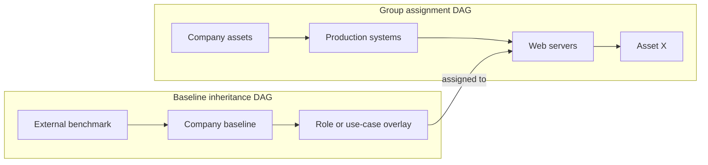

# Baseline Inheritance and Overlays

Status: **Working proposal with prototype (v0.2)**  
Last updated: **2026-08-23**

This document proposes how an internal company policy can inherit from an
external hardening benchmark, document deliberate deviations, and produce a
fully rendered policy for each asset.

## 1. Two separate DAGs

The architecture contains two related but distinct directed acyclic graphs:



- The **baseline inheritance DAG** answers: “How was this desired policy
  derived?”
- The **group assignment DAG** answers: “Why does this desired policy apply to
  this asset?”

The rendered assessment plan joins both provenance chains without conflating
them.

## 2. Core model

An imported benchmark is an immutable baseline. A company baseline may extend
it through an explicit overlay, and further overlays may specialize the company
baseline for server roles, environments, or other approved use cases. A
company baseline may also be authored independently when its hardening or
operational policy is not derived from an external benchmark. Adding external
references for assurance traceability does not turn that framework into an
inheritance parent.

```text
Imported benchmark@revision + digest
              ↓
Company overlay (tailor, exclude, substitute, annotate, add)
              ↓
Use-case overlay
              ↓
Resolved baseline release
              ↓
Group assignment
              ↓
Asset assessment plan
```

Assignments normally target the most-derived company baseline. They do not
separately assign every ancestor; inheritance brings ancestor controls into the
resolved baseline.

## 3. Why overlays are explicit

Baseline inheritance must not behave like object inheritance in a programming
language, where a child silently replaces a parent field. It also should not
use generic JSON Merge Patch or traversal-order precedence. Those approaches
make security-relevant changes difficult to review and explain.

Instead, an overlay contains typed operations. Each operation names its target,
states what changed, and includes the required governance metadata.

| Operation | Meaning | Normative deviation? |
|---|---|---|
| `tailor` | Change the desired parameter values of an inherited control | Yes |
| `exclude` | Keep the inherited control visible but do not evaluate it | Yes |
| `substitute` | Use a different implementation/evidence contract for the same desired outcome | Not necessarily |
| `annotate` | Change company-facing severity, text, mappings, or remediation | No |
| `add` | Add a new company control instance | No deviation from the parent |
| `resolve_conflict` | Proposed explicit resolution for divergent multiple-parent definitions; not accepted by the current schema or resolver | Depends on resolution |

There is deliberately no unqualified `remove` or arbitrary `replace` operation.

`annotate` may currently set `severity`, `remediation`, and `external_refs`.
These fields do not change the technical condition evaluated by Rego, but they
are still versioned policy metadata. An annotation overrides the reusable
control manifest default for that inherited instance, is recorded in the
rendered plan, and is not copied into the compact immutable result. Reporting
tools with a validated exact plan/result pair must display that plan-owned
resolved value rather than inventing their own remediation.

## 4. Stable identity and lineage

An inherited control instance keeps its stable instance ID through tailoring,
substitution, and annotation. This preserves its lineage and benchmark mapping.
An added company requirement receives a new company-owned instance ID.

These identifiers remain separate:

- **Control implementation ID** — reusable executable logic, such as
  `host.sshd.option_equals`.
- **Control instance ID** — a specific desired requirement inherited through
  baseline layers.
- **External reference** — benchmark rule identity and revision.
- **Definition fingerprint** — digest of the inherited control instance before
  an overlay changes it.

If two baselines merely instantiate the same implementation for independent
requirements, they use different instance IDs and remain separate results.
That is composition, not overriding.

## 5. Worked company overlay

The names and values below are illustrative rather than content from a real
benchmark.

An imported benchmark baseline might contain:

```json
{
  "apiVersion": "compliance.example/v1",
  "kind": "Baseline",
  "metadata": {
    "id": "benchmark.example.macos-hardening",
    "revision": "2026.1",
    "origin": {
      "type": "external-benchmark",
      "name": "Example macOS Hardening Benchmark"
    }
  },
  "spec": {
    "title": "Example macOS hardening benchmark",
    "controls": [
      {
        "instance_id": "benchmark.macos.ssh.max-auth-tries",
        "implementation": "host.sshd.option_equals",
        "external_refs": ["example-benchmark:5.2.1"],
        "parameters": {
          "option": "maxauthtries",
          "expected": 4
        }
      },
      {
        "instance_id": "benchmark.macos.remote-login-disabled",
        "implementation": "macos.sharing.service_disabled",
        "external_refs": ["example-benchmark:5.2.2"],
        "parameters": {
          "service": "remote-login"
        }
      }
    ]
  }
}
```

The company baseline pins that exact parent and describes its deviations:

```json
{
  "apiVersion": "compliance.example/v1",
  "kind": "BaselineOverlay",
  "metadata": {
    "id": "company.macos-workstation",
    "revision": 4
  },
  "spec": {
    "title": "Company macOS workstation policy",
    "extends": [
      {
        "baseline": "benchmark.example.macos-hardening@2026.1",
        "digest": "sha256:base..."
      }
    ],
    "operations": [
      {
        "op": "tailor",
        "target": "benchmark.macos.ssh.max-auth-tries",
        "expected_parent_fingerprint": "sha256:control-a...",
        "parameters": {
          "option": "maxauthtries",
          "expected": 6
        },
        "deviation": {
          "id": "DEV-0042",
          "classification": "operational-requirement",
          "rationale": "Company access workflow permits six attempts before disconnect.",
          "approval_ref": "risk-register/RISK-123",
          "review_after": "2027-01-31"
        }
      },
      {
        "op": "exclude",
        "target": "benchmark.macos.remote-login-disabled",
        "expected_parent_fingerprint": "sha256:control-b...",
        "deviation": {
          "id": "DEV-0043",
          "classification": "use-case-required",
          "rationale": "Managed build machines require restricted remote administration.",
          "approval_ref": "security-policy/remote-administration",
          "review_after": "2027-01-31"
        }
      },
      {
        "op": "add",
        "control": {
          "instance_id": "company.macos.endpoint-agent-installed",
          "implementation": "macos.homebrew.cask_required",
          "parameters": {
            "cask": "company-endpoint-agent"
          }
        }
      }
    ]
  }
}
```

The parent digest is computed from the complete imported baseline and pinned by
the overlay; it is not authored inside the parent baseline metadata. The expected control
fingerprint pins the exact definition being changed. These serve different
purposes: release integrity and safe rebase detection.

## 6. Deviation versus waiver

These must remain distinct:

| Mechanism | Purpose | Lifecycle | Changes rendered policy? |
|---|---|---|---|
| **Overlay deviation** | Deliberate company policy that differs from its parent benchmark | Versioned and reviewed like policy | Yes |
| **Waiver** | Temporary exception where an asset cannot yet meet effective company policy | Scoped, approved, and expiring | No |

An overlay says, “This is our desired policy.” A waiver says, “This asset does
not currently meet our desired policy, and the failure is temporarily
accepted.” Turning long-lived company tailoring into waivers would obscure the
actual policy; turning temporary exceptions into overlays would normalize
drift.

### 6.1 Implemented persona and feature pattern

A server persona or approved feature can legitimately require hardening that
differs from the general server baseline. The server-personas example uses this
pattern:

1. an authoritative inventory source supplies the persona or feature label;
2. that label selects a stable inventory group;
3. the group receives a reviewed derived baseline;
4. any `tailor`, `exclude`, or `substitute` operation records the durable
   persona-wide deviation and its approval; and
5. a subject-specific temporary failure against that effective persona policy
   uses an expiring waiver instead of another overlay.

The standard and feature groups are sibling assignment scopes. The feature
baseline inherits the standard company baseline, but a subject receives only
the leaf baseline selected for its persona. Assigning both the base and its
tailored child would create two definitions of the same stable instance and is
not an override mechanism.

This avoids using waivers as a long-lived policy-selection system and keeps
persona-label sourcing and approval in the governed inventory path. The synthetic
`host/persona-conflict-01` selects both sibling groups: their definitions
accumulate without order precedence and the effective plan is inspectably
invalid. The initial exact subject/control waiver contract validates bounded
approval windows, applies only to an underlying failure, persists the original
failure and approval snapshot, and does not change generated desired state.
See [`waivers.md`](waivers.md).

Rendered controls retain immutable derivation records for normative overlay
operations. Each `tailor`, `exclude`, or `substitute` record contains the
overlay reference, pinned parent fingerprint, inherited control lineage, exact
implementation/parameters/disposition before the operation, and the resulting
state. Tailoring and exclusion records also embed their reviewed deviation;
substitution records retain the equivalence reference. Explain views therefore
show what changed without re-resolving a possibly newer policy catalog.

## 7. Compilation and rebase rules

The baseline compiler validates every authored baseline and overlay against its
kind-specific JSON Schema, then resolves overlays before group assignment:

1. Load every pinned parent and verify its digest.
2. Reject cycles in the inheritance DAG.
3. Compose parent controls without traversal-order precedence.
4. Coalesce identical definitions of the same instance while retaining all
   parent provenance.
5. Treat divergent definitions of the same instance as a conflict.
6. Apply each typed overlay operation to an existing fingerprinted target.
7. Reject missing targets, stale fingerprints, duplicate operations, or
   undocumented normative deviations.
8. Validate every effective active and excluded control instance against its
   implementation's parameter schema, including results of `tailor`,
   `substitute`, and `add`; reject unknown implementations or invalid
   parameters.
9. Produce a canonical resolved baseline containing active controls, excluded
   controls, deviation records, and the complete ancestry.

When an upstream benchmark changes, the overlay does not float silently to the
new content. Updating the pinned parent causes operations whose target
fingerprints changed to fail compilation. A policy author must review and
re-acknowledge each affected deviation.

Multiple inheritance is allowed, but parent order has no semantic meaning.
“Last parent wins” is forbidden. The proposed `resolve_conflict` operation is
not implemented or accepted by the current schema, so a divergent inherited
definition currently remains a hard resolution error.

## 8. Rendered assessment plan

The fully rendered plan should include both active and excluded inherited
controls:

```json
{
  "baseline_lineage": [
    {
      "id": "benchmark.example.macos-hardening",
      "revision": "2026.1",
      "digest": "sha256:base..."
    },
    {
      "id": "company.macos-workstation",
      "revision": 4,
      "digest": "sha256:overlay..."
    }
  ],
  "controls": [
    {
      "instance_id": "benchmark.macos.ssh.max-auth-tries",
      "disposition": "evaluate",
      "alignment": "tailored",
      "parameters": {"option": "maxauthtries", "expected": 6},
      "deviation_id": "DEV-0042",
      "lineage": [
        {"baseline": "benchmark.example.macos-hardening@2026.1", "operation": "inherited"},
        {"baseline": "company.macos-workstation@4", "operation": "tailor"}
      ]
    },
    {
      "instance_id": "benchmark.macos.remote-login-disabled",
      "disposition": "excluded",
      "alignment": "deviated",
      "deviation_id": "DEV-0043"
    }
  ]
}
```

Only controls with `disposition: evaluate` are submitted to OPA. Excluded
controls remain visible in policy rendering and benchmark-difference reports.

## 9. Reporting semantics

Reporting must keep two claims separate:

- **Company policy status** — whether the asset satisfies the fully rendered
  company baseline.
- **Parent benchmark alignment** — which inherited benchmark controls are
  unmodified, tailored, substituted, excluded, or supplemented.

A passing company assessment with documented deviations must not be labelled as
unaltered benchmark conformance. Reports should expose deviation IDs and
ancestry rather than attempting to hide the differences in a single score.

Standalone company policy follows the same rule. Its technical controls can
map to several external requirements without changing their company ownership
or introducing an external parent baseline. Those mappings demonstrate
technical alignment only. A complete objective-level claim requires a reviewed
company `ControlRequirement` and complete selected `ControlRealization`; a
whole-framework claim additionally requires complete declared framework scope.

## 10. Governance choices still open

- Which deviation fields are mandatory and whether approvals live in Git,
  another governance system, or both.
- Whether `review_after` is mandatory for every deviation or only selected
  classifications.
- Whether `substitute` requires evidence of semantic equivalence and who can
  approve it.
- How upstream control identifiers and mappings are imported and updated.

## 11. Prototype status

The executable suite implements this inheritance chain with a small
tooling-owned synthetic macOS fixture and the active mock-fleet project. The
resolver currently supports pinned parent digests, control fingerprints, `tailor`,
`exclude`, `substitute`, `annotate`, and `add`. Its rendered plan keeps
active and excluded controls separate while preserving both baseline and group
assignment provenance.

The prototype validates `Control`, `Baseline`, and `BaselineOverlay` with
strict Draft 2020-12 schemas. Each control manifest references a valid parameter
schema kept inside its control directory. `compliance policy validate` checks
all authored documents and every resolved release, then validates all active
and excluded effective instances against their implementation contracts.
Assessment plans retain structured validation failures as resolution errors
rather than crashing or evaluating partially valid policy.

Automated tests cover successful tailoring and exclusion, stale fingerprints
after an upstream rebase, and divergent independently applicable definitions.
Conflict resolution, review-date enforcement, and external approval verification
remain future work.

The mock cloud fleet adds two framework-derived profiles mapped to CSA CCM
v4.1: one for an AWS account and one for a generic SaaS tenant. They deliberately
contain only the technical instances exercised by the example and identify
themselves as illustrative profiles rather than imported CCM catalogs. Their
company overlays demonstrate retention tailoring, company remediation
annotations, and added internal controls. Passing either rendered baseline is
therefore a company-policy claim over that profile, not a claim of complete or
unaltered CSA CCM conformance.
