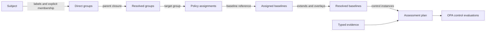
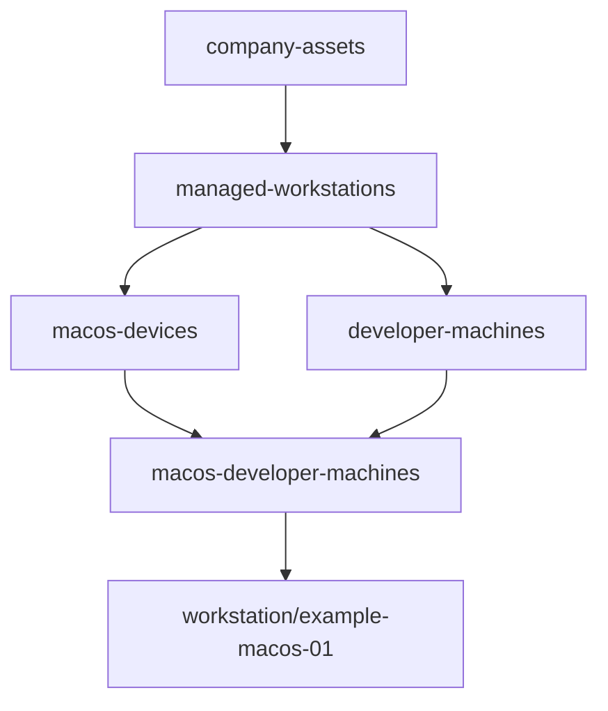

# Inventory, Groups, and Policy Assignments

Status: **Working proposal with prototype (v0.1)**  
Last updated: **2026-09-12**

This document defines how governed assets enter the inventory, how they become
members of a group DAG, and how group-level policy assignments resolve to
baselines and ultimately to control checks.

## Closed-world operation accounting

[ADR 0016](../../docs/adr/0016-closed-world-policy-assessment.md) is implemented by
[#78](https://github.com/packetlss/compliance/issues/78). The embedded
[operation projection](operation-accounting.md) freezes supplied selection,
Subject/group/assignment facts and expected policy membership before evaluation.
Dangling explicit Subject references fail catalog loading. Direct membership
retains simultaneous inherited edges; each Subject is assessed once.
Accounting is exact to supplied inputs, never a guarantee of external inventory
exhaustiveness. Unassigned remains distinct from explicit N/A. New architecture or
escalation requires a new focused promotion; no second inventory hierarchy is introduced.

## 1. Complete relationship



Each edge answers a separate question:

| Relationship | Question answered |
|---|---|
| Subject → group | Why is this asset in this operational or policy scope? |
| Group → assignment | Which company policy is attached to that scope? |
| Assignment → baseline | Which versioned desired state was selected? |
| Baseline → parent baseline | How was company policy derived from benchmarks or shared policy? |
| Baseline → control | Which independently attributable requirements are effective? |
| Control → evidence | Which observations are required to evaluate the requirement? |

## 2. Inventory is not evidence

The inventory identifies **what exists** and supplies trusted grouping
attributes. Evidence describes **how a subject is currently configured**.

For example:

- Inventory: `host/standard-app-01` is an active, managed Linux application
  host.
- Evidence: the host currently has the required package and access settings.

Collectors may discover subjects or suggest inventory attributes. Labels that
affect applicability require governed sourcing and stable meaning; environment,
ownership, criticality, management state, persona, access profile, deployment
model and lifecycle may come from authoritative inventory integrations or reviewed
configuration.

### 2.1 Upstream authoring and core resolution authority

The inventory in this platform is a **read-only projection** used to determine
which policy applies. Systems such as Ansible inventory, a CMDB, NetBox, a
service catalog, cloud APIs, or reviewed static files remain authoritative for
authoring and sourcing the subject data they supply. Once normalized inventory is
supplied for an operation, that exact projection is authoritative input to
deterministic closed-world resolution. The core does not independently rediscover
facts or choose a different policy because it considers an upstream value mistaken.
A wrong governed projection may therefore resolve wrong intent and must be corrected
through its upstream governance or configuration path.

The projection layer may:

- ingest and normalize records from several source types;
- correlate a source record with a stable compliance subject identity;
- retain immutable source snapshots and revision digests for reproducibility;
- expose source freshness, provenance, and conflicts; and
- calculate direct and inherited group membership.

It must not:

- become the editorial owner of imported lifecycle, ownership, or
  configuration data;
- write normalized values back to upstream systems during ordinary ingestion;
- silently choose a value merely because one source was processed last; or
- present a stale cached projection as current without exposing its age and
  source status.

The compliance platform remains authoritative for its own objects: group
definitions and selectors, policy assignments, baseline releases, rendered
assessment plans, decisions, findings, and waivers.

Stable governed classifications may legitimately determine group, policy and
realization applicability. Inventory should express domain facts rather than name
policy-resource identities or realization IDs/digests directly; policy owns the
mapping from those facts to concrete implementation semantics. Direct identity
coupling is undesirable authoring practice, not a new schema prohibition.

The source-snapshot concern above is ingestion provenance, not another current
inventory resource or producer contract. The implemented producer surface remains
individual `Subject` resources; it has no inventory snapshot, synchronization, or
discovery-framework abstraction.

### 2.2 Canonical authoring conventions

The canonical inventory contract uses familiar Kubernetes resource
conventions while remaining usable as ordinary YAML or JSON without a
Kubernetes cluster:

- every object has `apiVersion`, `kind`, `metadata`, and a kind-specific
  `spec`;
- stable machine identity is separate from mutable display text;
- labels are short string attributes used by selectors;
- annotations hold non-selecting descriptive or source metadata;
- references are explicit and typed rather than inferred from nesting; and
- YAML and JSON are equivalent serializations of the same validated resource.

The initial `Subject`, `InventoryGroup`, and `PolicyAssignment` schema is
implemented in `schemas/inventory/resource.schema.json` and enforced before
planning. Namespace semantics and whether some system-produced synchronization
information eventually belongs in a resource `status` remain open.

Every authored inventory YAML file declares that schema in its first-line
`yaml-language-server` directive. This gives editors the same contract enforced
by the loader. A repository test resolves every YAML schema directive and
validates every document, including the separate project configuration schema.

This direction is compatible with Ansible as an input or output adapter, but
the formats are not intended to be interchangeable. Ansible inventory uses
hosts, child groups, and flattened variables with precedence. The canonical
compliance resources use subjects, explicit parent references, selectors, and
accumulating assignments with no last-writer-wins behavior. An adapter maps
between those models without importing Ansible's policy-merge semantics.

### 2.3 Resource packaging

Packaging is separate from resource semantics:

- **One resource per file** is the preferred human-maintained Git format. It
  gives useful reviews, `git blame`, ownership boundaries, and low-conflict
  concurrent edits.
- **Multi-document YAML** is the preferred generated or streaming format. An
  importer can emit a complete set of subjects and relationships discovered
  from Ansible, ServiceNow, NetBox, a cloud API, or another upstream system.
- **Typed List resources** are deferred until an inventory API needs bulk or
  paginated responses; they are not a primary authoring format.

The loader normalizes individual files and multi-document streams into the same
resource set. File paths, document boundaries, and document ordering have no
semantic meaning. Duplicate identities are errors, and the same logical set
must produce the same revision digest regardless of packaging.

Generated multi-document snapshots do not necessarily belong in Git. They may
be validated and ingested directly. If an organization requires reviewed
GitOps ingestion, an importer can instead materialize deterministic
one-resource-per-file output so diffs show individual subject changes.

## 3. Subject contract

A subject is the stable inventory identity of one governed object:

```yaml
apiVersion: compliance.example/v1alpha1
kind: Subject
metadata:
  name: example-macos-01
  labels:
    company: internal
    managed: "true"
    os: macos
    persona: developer
spec:
  id: workstation/example-macos-01
  type: macos-workstation
  lifecycle: active
  source:
    name: prototype-local-file
    externalId: example-macos-01
    observedAt: "2026-08-23T10:00:00Z"
```

`metadata.name` follows Kubernetes naming conventions and identifies the
authored resource. `spec.id` is the stable domain identity referenced by
evidence and explicit membership; it is deliberately not inferred from a
display name or source-system hostname. Labels are strings and may select
policy. Rich source-specific data belongs under the open `spec.attributes`
object rather than being forced into labels.

Subject IDs are opaque, stable identifiers with a type prefix. They should not
be derived from mutable display names. Examples include `host/server-123`,
`cloud-account/aws-123456789012`, and `saas/github/example-org`.

Subject lifecycle values should include at least `active`, `retired`, and
`unknown`. Retiring a subject stops normal assessment scheduling but does not
delete its historical plans, evidence, or results.

### 3.1 Producer-facing normalization contract

An inventory adapter emits one `Subject` for each governed object. The stable,
cross-source contract is:

- `spec.id`: stable opaque subject identity used by evidence and references;
- `spec.type`: normalized governed-object type used for control compatibility;
- `spec.lifecycle`: normalized `active`, `retired`, or `unknown` state;
- `spec.source`: source name, external identity, observation time, and optional
  source revision;
- `metadata.labels`: trusted normalized strings available to group selectors;
- `metadata.annotations`: non-selecting descriptive or source metadata; and
- `spec.attributes`: the open, rich adapter-specific extension point.

Adapters should put provider/domain records under `spec.attributes` rather than
create provider-specific `Subject` families or flatten them into selector labels.
Promoting an attribute into a normalized label is a deliberate governance choice:
labels can change applicability, so they need stable meaning and trusted sourcing.
Selectors consume only `metadata.labels`; they never traverse arbitrary
`spec.attributes` or annotations.

`InventoryGroup` and `PolicyAssignment` remain governance-owned inputs. An
inventory producer supplies normalized subjects; it does not choose its own group
membership or desired policy. This contract introduces no second hierarchy,
snapshot resource, synchronization service, or discovery framework.

## 4. Group contract

A group represents a reusable scope for inventory and policy. A group may have
multiple parents and may select members explicitly, dynamically, or both:

```yaml
apiVersion: compliance.example/v1alpha1
kind: InventoryGroup
metadata:
  name: macos-developer-machines
spec:
  parentRefs:
    - name: macos-devices
    - name: developer-machines
  selector:
    matchLabels:
      os: macos
      persona: developer
  subjectRefs:
    - id: workstation/special-build-machine
```

`parentRefs` is a compliance-domain relationship. It must not be represented by
Kubernetes `metadata.ownerReferences`, which carry lifecycle and deletion
semantics that do not apply to grouping.

Membership rules are:

1. Explicit membership or a matching selector establishes direct membership.
2. Membership in a child implies membership in all its ancestors.
3. Membership in a parent does not imply membership in any child.
4. Multiple parents are allowed; cycles are rejected.
5. Every resolved membership retains its source: explicit member, selector, or
   inheritance path.
6. Group IDs are stable. Renaming a display label must not silently retarget an
   assignment.

Groups and classifications need not be mutually exclusive. Overlapping factual
membership preserves every path, and every applicable assignment accumulates.
Neither group depth, specificity nor ordering chooses a winner.

Selectors belong to group definitions. Policy assignments should not introduce
a second selector language; they target stable group IDs.

## 5. Assignment contract

A policy assignment creates the many-to-many relationship between groups and
baselines:

```yaml
apiVersion: compliance.example/v1alpha1
kind: PolicyAssignment
metadata:
  name: macos-company-policy-assignment
spec:
  targetRef:
    kind: InventoryGroup
    name: macos-devices
  baselineRefs:
    - name: company.macos-policy
      revision: "1"
```

Revisions are strings and should be quoted in YAML. The planner normalizes each
pair to the immutable internal reference `name@revision`.

The wire reference is kindless. Under
[ADR 0019](../../docs/adr/0019-typed-identifier-namespaces-and-schema-uri-ownership.md),
a supplied composition must therefore reject the same `name@revision` appearing in
both the technical Baseline/BaselineOverlay catalog and the RequirementBaseline
catalog before planning, without preference or fallback. This fail-closed collision
admission rule is implemented under #136.

The assignment contains no Rego, evidence, or control parameters. The baseline
contains no group selectors or asset IDs. This boundary allows inventory
structure and policy content to change independently.

Initial assignment rules are:

1. Assignments target groups only.
2. To target one asset, create an explicitly populated singleton group. This
   preserves the same explanation and resolution path as every other policy.
3. A group can have multiple assignments and one baseline can be assigned to
   multiple groups.
4. Assignments accumulate; they have no order or implicit precedence.
5. Identical control instances reached through several assignments are
   evaluated once while retaining every assignment path as provenance.
6. Divergent definitions with the same control instance ID make the assessment
   plan invalid until policy authors resolve the conflict explicitly.
7. Assignments reference immutable baseline revisions within a policy release.

Assignment metadata may later add activation windows or an advisory/enforced
mode. Collection cadence and waivers remain separate concepts.

## 6. Assignment and baseline inheritance are different

Consider this subject:



The group assignments are:

| Group | Baseline reference |
|---|---|
| `managed-workstations` | `managed-workstation@1` |
| `macos-devices` | `company.macos-policy@1` |
| `macos-developer-machines` | `company.developer-workstation@1` |

The baseline inheritance is:

```text
benchmark.example.macos-hardening@2026.1
└── company.macos-policy@1
    └── company.developer-workstation@1
```

The developer asset reaches `company.macos-policy@1` twice: directly through
the `macos-devices` assignment and as an ancestor of the developer overlay.
Identical stable control instances are coalesced, but both provenance paths are
stored in the plan.

## 7. Deterministic resolution

For one subject and one point in time, the planner performs:

1. Validate subject identity, type, lifecycle, and governed labels.
2. Match explicit membership and group selectors.
3. Calculate the complete ancestor closure in the group DAG.
4. Select every assignment whose target group is resolved.
5. Resolve each assignment's baseline inheritance DAG, pinned parent digests,
   and overlay operations.
6. Accumulate active, excluded, and eventually not-applicable controls.
7. Coalesce identical control instances and retain all provenance paths.
8. Reject unresolved conflicts, cycles, missing references, or stale overlay
   fingerprints.
9. Produce a canonical, content-addressed assessment plan.

No filesystem ordering, group traversal order, assignment order, or parent
ordering may affect the result.

## 8. Frozen assessment identity

Catalog-wide inventory and assignment revisions are not assessment identities.
Before evaluation, the embedded operation freezes only its exact request,
mode-sensitive selection witness, relevant assignments, composition commitment,
selected-member resolution facts and compact expected membership. Each member's
complete resolved intent has an operation-independent `member_plan_digest`; the
operation ID binds the selected set, and each exact plan ID binds that operation
to one subject.

An inventory fact changes assessment identity only when consumed by selection or
member policy resolution. For example, changing `persona=developer` to
`persona=standard` changes identity when that label affects a relevant selector or
realization, while unrelated annotations and unsupplied catalog material do not.

## 9. Ownership and storage

The current proposed ownership is:

| Object | Authority | Initial storage |
|---|---|---|
| Subject identity and lifecycle | External system designated for the subject domain | Local projection store; local YAML projection in prototype |
| Governed subject labels | External authority or reviewed configuration per label namespace | Local projection store with source provenance; authoritative resolution input when supplied |
| Group definitions and selectors | Platform/security policy owners | Git-backed policy repository |
| Explicit group membership | External inventory source or reviewed configuration | Projection store or Git, with provenance |
| Policy assignments | Platform/security policy owners | Git-backed policy repository |
| Baselines and overlays | Policy authors | Git-backed policy repository |
| Rendered assessment plan | Assessment planner | Immutable plan/evidence store |

If a field can change which controls apply, its authority and revision must be
recorded. The local projection is not itself the authority merely because it
stores a normalized copy. Collector-provided configuration evidence is not
automatically a trusted policy-selection attribute.

## 10. Inventory and current coverage operator views

The implemented operator sequence is `Inventory → Coverage → Assessment`.
`asset` / `assets` is user-facing CLI vocabulary only; the normalized resource,
schema, internal object, wire fields, and identity remain `Subject`.

The inventory and policy interface should expose:

- **Asset inventory** — identity, lifecycle, trusted labels, and provenance.
- **Resolved memberships** — direct and inherited groups with explanation.
- **Group members** — all subjects currently resolved into a group.
- **Group assignments** — baselines attached directly to the group.
- **Group policy contribution** — controls contributed by the group and its
  baseline ancestry.
- **Rendered subject policy** — final active, excluded, and not-applicable
  controls for one subject.
- **Explain assignment** — the complete subject → group → assignment → baseline
  → overlay → control path.
- **Compare subjects** — plan IDs and policy differences across a group.

The prototype exposes the first inventory-oriented views through the unified
operator CLI. The project registry selects an isolated named project whose paths
are loaded from that project's `compliance.yaml`:

```sh
scripts/dev cli inventory validate

scripts/dev cli inventory list assets

scripts/dev cli inventory graph

scripts/dev cli inventory explain cloud-account/aws-111122223333

scripts/dev cli coverage list assets

scripts/dev cli coverage list groups --format json

scripts/dev cli coverage list assignments

scripts/dev cli coverage explain cloud-account/aws-111122223333
```

Inventory list/explain is limited to supplied normalized facts and resolved
membership attribution. Policy applicability is a coverage concern. Coverage
reuses the planner and derives exactly `result_required`, `inactive`,
`unassigned`, `no_assessable_policy`, or `invalid_resolution`; it does not own
another applicability algorithm. Group and assignment views retain zero-effect
rows and keep current members, assignment presence, assessable checks/Objectives,
and invalid resolution separate.

The JSON forms are purpose-specific experimental query projections. They are
not resources, snapshots, digests, caches, plans, assessment inputs, or durable
facts, and no query writes generated state. Supplied inventory is never presented
as proof of external inventory exhaustiveness.

The root development registry defaults to `mock-fleet`, which exercises the
contract with `aws-account` and `saas-tenant` subjects. Root-registered projects
are selected from the checkout root with `--project`. The `iam-realization`
project separately exercises a `linux-host` and requirement-baseline assignment;
because its private realization tree must be independently materialized, it is
exercised through `scripts/dev gate iam` rather than the root registry. Each
project retains its own inventory, evidence, plans, and results. Each
mock-fleet subject resolves through a provider/service-model branch and
a production branch before reaching a multi-parent assignment group. This
keeps external system type, environment, and the resulting policy scope visible
without embedding assignments in the subject records.

Maintained projects put `Subject` resources under `inventory/subjects/`,
`InventoryGroup` resources under `inventory/groups/`, and
`PolicyAssignment` resources under `assignments/`. These directories improve
reviews and navigation but do not add namespace or precedence semantics. The
complete convention is documented in
[`project-layout.md`](project-layout.md).

Derived accounting/applicability and evaluation views are exposed separately:

```sh
# Exact-operation overview; filter outcome and current plan alignment independently.
scripts/dev cli assessment status --plan PLAN --assessed-plans PLANS \
  --at RFC3339 --as-of RFC3339 --group aws-accounts --outcome fail

# Roll up the same exact operation by every resolved DAG group.
scripts/dev cli assessment status --by group --plan PLAN --at RFC3339 --as-of RFC3339

# Explain one exact asset slot from bounded retained artifacts.
scripts/dev cli assessment explain cloud-account/aws-111122223333 \
  --plan PLAN --assessed-plans PLANS --at RFC3339 --as-of RFC3339
```

On `assessment status`, `--group`, `--outcome`, and `--plan-alignment` are
independent repeatable filters: values within one dimension use OR semantics and
different dimensions combine with AND semantics. An asset matching any selected
group, outcome, and plan-alignment filter is shown. Group
rollups use frozen resolved membership, including ancestors. Because inventory is
a DAG, one asset is intentionally counted in every group to which it
resolves; group totals must not be added together as a fleet total. Every view
has an equivalent `--format json` document.

## 11. Failure and accounting states

The planner distinguishes policy resolution, derived accounting disposition,
and evaluation outcome.
These are related but different dimensions:

- **Invalid plan** — a cycle, missing reference, conflict, stale overlay, or
  other resolution failure means policy could not be determined safely.
- **Unassigned subject** — the subject resolves successfully but no baseline is
  assigned. This is a coverage gap, not compliance.
- **Inactive subject** — a retired subject is retained for history but is not
  scheduled or evaluated normally.
- **Assigned subject** — at least one assignment applies. An exact result is
  required only when resolution is valid, lifecycle is active, and at least one
  active control or rendered requirement remains after resolution.
- **Unknown assessment** — policy resolves, but required evidence is absent or
  stale.
- **Failing assessment** — fresh evidence proves that an active control is not
  satisfied.

An authored lifecycle of `unknown` prevents publication of a valid operation
because the planner cannot safely determine whether assessment should occur. A
retired lifecycle derives `inactive`. An assigned policy containing no active
controls or requirements derives `no_assessable_policy`, not pass. The evaluator
refuses every plan whose derived disposition is not `result_required`.

The exact-operation overview keeps immutable outcome, expected-slot presence,
accounting, and current qualification separate. A historical PASS remains
`historical_outcome: pass` when a comparison operation yields
`plan_alignment: different_plan`. An unfilled exact slot has
`historical_outcome: null` plus `expected_result_slot.present: false`; missing is not
an immutable outcome. The asset explanation and `status --by group` preserve these
dimensions and never reduce them to a compliance percentage. Current coverage is
queried separately through `coverage`.

## 12. Prototype limitations

- The prototype reads Kubernetes-shaped YAML or equivalent JSON resources from
  directories rather than inventory source adapters and a projection store.
- `Subject`, `InventoryGroup`, and `PolicyAssignment` are validated against
  `schemas/inventory/resource.schema.json` before normalization.
- Only exact label matching and explicit members are currently modeled.
- Inventory governance and source attribution are documented; content addressing
  does not authenticate the real-world truth of supplied labels.
- `Subject.spec.source` is required, but full-snapshot, delta, pagination,
  atomic activation, stale-source, and source-conflict semantics are not yet
  implemented.
- Namespace semantics and a system-produced resource `status` remain undefined.
- Explicit `subjectRefs` do not carry per-relationship source provenance. A
  separate membership resource should be evaluated only when a concrete
  multi-source relationship use case requires it.
- Multi-document YAML is supported, but Kubernetes List resources are deferred
  until an API needs them.
- Subject lifecycle now gates assessment: retired subjects are inactive and an
  unknown lifecycle is invalid. Historical retention and reactivation workflow
  are not yet implemented.
- Assignment activation windows and enforcement modes are not implemented.
- Coarse control applicability is validated by subject type; a first-class
  rendered `not_applicable` collection is still to be designed.
- Coverage is deliberately calculated from the current supplied file projection and
  is never persisted as historical state. Frozen assessment history is interpreted
  only through its exact operation, retained plans, and results.
