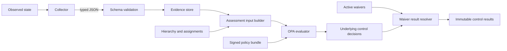

# Policy and Baseline Model

Status: **Working draft (v0.1)**  
Last updated: **2026-09-06**

This document describes how policy as code can represent host configuration,
software baselines, SaaS settings, and other state expressible as JSON without
placing policy on the governed object.

## 1. Boundary

The evaluation service has one job:

> Given a subject, its typed evidence, its resolved baseline, active waivers,
> and its operation-bound member plan, produce deterministic control results.

Collectors do not know the desired state. Reporters do not reinterpret Rego.
Governed objects do not receive policy bundles.



## 2. Separate reusable logic from desired state

We should avoid writing host-specific Rego. Policy is divided into three
layers:

1. **Control implementation** — reusable Rego logic plus an intrinsic authored
   check title and purpose, such as “required packages are installed” or “an
   effective SSH option has the expected value.”
2. **Control instance** — a control plus parameters, identity, severity, and
   remediation. For example, require packages `a`, `b`, and `c`.
3. **Baseline** — a versioned set of control instances attached to stable
   inventory groups through policy assignments.

This permits the same package control to serve a workstation baseline, a Linux
server baseline, and a database server baseline with different package lists.

The same resolved control records are available to separately implemented
external programs through the assessment plan. Core tooling does not compile
or render configuration. An external program can map stable implementation
IDs, definition fingerprints, resolved parameters, instance identity, lineage,
deviations, and plan provenance into its own IaC, PaC, MDM, ticketing, or
configuration-management output.

### Two policy paths, one assessment plan

The platform intentionally supports both operational desired-state enforcement
and higher-level control assurance. They share inventory resolution, typed
evidence, OPA implementations, immutable plans, and technical result contracts,
but they make different claims:

```text
Direct technical policy
Group assignment → Baseline / BaselineOverlay → technical control instances
                                                   ↓
                                                results

Objective assurance
Group assignment → RequirementBaseline → ControlRequirement
                                             ↓ selected ControlRealization
                                      technical control instances
                                             ↓ results and allOf roll-up
                                  requirement and top-baseline results
```

The direct path is sufficient for concrete desired state: required packages,
hardening settings, kernel parameters, cloud configuration, SaaS options, and
similar conditions. These checks can prevent drift and provide useful fleet
status without claiming to exhaustively implement a broader governance
objective. A plan containing this path alone correctly reports zero
objectives while still evaluating all assigned technical controls.

Use the objective-assurance path when policy owners need a defensible answer to
a higher-level question such as “is role-based access implemented for this
environment?” The `ControlRequirement` states the technology-neutral outcome;
the selected `ControlRealization` makes the reviewable completeness assertion
that its declared checks jointly prove that outcome; and the
`RequirementBaseline` produces the higher-level baseline view. A single IAM
objective may therefore require several independently evaluated package,
identity-domain, SSH authorization, and local-account checks.

A subject may receive both paths. For example, a Linux server can be assessed
against an IAM objective while also receiving a standalone software baseline
whose package rules have no meaningful regulatory parent. Do not create a
placeholder `ControlRequirement` merely to make the objective count non-zero.
Create one when its technology-neutral intent, completeness boundary, adoption
state, and top-level roll-up are genuine governance artifacts.

The practical authoring rule is:

| Need | Use |
|---|---|
| Enforce or monitor concrete configuration and drift | Technical `Baseline` or `BaselineOverlay` |
| Report a complete company or framework objective | `ControlRequirement`, `ControlRealization`, and `RequirementBaseline` |
| Do both on the same subject | Assign both; render them into one subject plan |
| Associate a check with a framework without claiming completeness | Technical `external_refs` mapping |

The objective result is an evidence-backed internal assurance claim. Whether
it is sufficient for certification, audit acceptance, or a legal compliance
conclusion remains a governance decision outside OPA.

### Internal policy, external assurance, and the intended way of working

Company policy is useful independently of an external framework. A standalone
technical baseline may express widely used hardening or operational desired
state, while a company `ControlRequirement` may express an internal objective
with no `external_refs`. External requirements are complementary inputs: when
one applies, policy owners record a reviewed company interpretation rather than
treating broad framework prose as executable logic.

The mapping relationship is many-to-many. One company requirement or technical
check may support several external references, and one external requirement
may need several company requirements and realizations. Those relationships do
not create precedence or merge parameters. Identical stable technical
instances may coalesce in a rendered plan with every provenance path retained;
divergent definitions remain resolution errors.

External assurance is most useful when operators can follow more than a
mapping identifier. A complete explanation should connect a versioned external
requirement and declared scope to the reviewed company interpretation, the
technology-neutral `ControlRequirement`, the intended operating practice, the
selected environment `ControlRealization`, its technical controls, current
evidence, and the conservative requirement result. Remediation and external
delivery workflows may act on resolved desired state, while deviations,
waivers, unknowns, and uncovered gaps remain visible.

The intended operating practice describes ownership, approvals, change
workflow, and the relationship between people and technical systems. It is not
currently a normative policy resource and does not count as evidence. When a
manual or procedural step is necessary to prove the objective, the realization
needs a suitable independently attributable check and evidence contract, or
the scenario and report must identify that step as unverified.

An objective assessment claims only that its selected complete realization
satisfied the declared company requirement for the assessed subject and time.
Whole-framework fulfillment additionally requires a complete, versioned scope
of applicable requirements and visible treatment of omissions and
not-applicable determinations. Technical `external_refs`, illustrative
profiles, and passing company policy remain insufficient on their own. The
scenario documentation and verification rules are defined in
[`verification-scenarios.md`](verification-scenarios.md).

For requirements with a technical implementation, the explanation has two
related branches from the same resolved control parameters:

```text
reviewed company interpretation -> realization -> effective technical controls
                                               |-> external adapter handoff
                                               `-> typed evidence -> OPA result
```

The adapter branch permits a separate program to produce delivery output from
the resolved controls. The evidence branch shows whether the governed subject
currently exhibits that state. Generated or applied external output does not
satisfy the requirement without subsequent observation. Conversely,
technical settings prove only the portions of a broad requirement they
actually cover; procedural or organizational portions require suitable
evidence and checks or remain explicit gaps.

### High-level objective implementation

An external mapping on one technical instance does not prove that a complete
high-level control objective has been implemented.

The implemented initial contract in
[`control-realization.md`](control-realization.md) separates a shared,
technology-neutral `ControlRequirement` from an environment-private
`ControlRealization`. The realization pins the parent intent, declares adoption
and applicability, expands into technical instances, and defines a constrained
roll-up expression. This permits the final compilation and evidence to remain
inside a need-to-know environment while still producing an attributable top
requirement and requirement-baseline result. The planner selects exactly one
applicable complete realization, freezes its checks and provenance into the
subject plan, and the evaluator performs the conservative roll-up.

### Control manifest

The manifest below describes the current executable contract. System
[ADR 0012](../../docs/adr/0012-explicit-policy-parameter-resolution.md) accepts
policy/baseline/requirement ownership of effective evidence `max_age`, with
Controls retaining required dependency contracts and optional capability restrictions.
Explicit bindings and descendant tailoring choose values; constraints, defaults
and min/max do not. [#73](https://github.com/packetlss/compliance/issues/73) owns
the coordinated migration. [Explicit policy parameters](policy-parameters.md)
defines declaration, binding, consumption and frozen provenance fields. Effective
ages are required policy inputs; Controls provide no fallback.

Each control implementation has a machine-readable manifest beside its Rego
module. Rego contains decision logic; the manifest provides discovery and
dependency metadata to the rest of the platform. The examples below use YAML
for readability; the dependency-free prototype currently uses equivalent JSON.

```yaml
apiVersion: compliance.example/v1
kind: Control
metadata:
  id: linux.packages.required
  version: 1
spec:
  title: Required host packages are installed
  purpose: Verify that every package mandated by policy is installed.
  entrypoint: data.compliance.controls.linux.packages_required.evaluate
  applies_to: [linux-host]
  evidence:
    - id: packages
      type: linux.packages/v1
  parameters_schema: parameters.schema.json
  defaults:
    severity: high
    remediation: Install missing packages from the approved repository
```

The title and purpose are identity-bearing authored meaning, but never executable
input. They remain invariant across parameter tailoring and are distinct from
remediation. This makes dependencies visible without parsing Rego. An assessment planner can
identify missing or stale evidence before evaluation, and collector scheduling
can understand which evidence types are demanded by assigned baselines. The
strict Draft 2020-12 control-manifest schema rejects unknown fields and requires
the implementation identity, entrypoint, applicable subject types, evidence
requirements, and a control-local parameter-schema reference. The referenced
schema must exist, be a valid Draft 2020-12 schema, and resolve inside the
control directory.

`compliance policy validate` resolves every authored technical baseline and
validates the effective parameters of every active or excluded control instance
against its implementation's parameter schema. It also loads requirement
baselines and complete realizations, validates their digest pins and `allOf`
mappings, and validates every embedded technical instance against the same
implementation contract. Unknown implementations are rejected. The policy
gate compiles the complete Rego tree with OPA and parses its rule heads to prove
that every manifest entrypoint names an existing decision. It also indexes
evidence schemas by `properties.type.const` and requires every declared
evidence type and subject type to resolve compatibly.

### Severity and remediation precedence

Severity and remediation are desired-policy metadata, not prose invented by a
collector, Rego implementation, or reporter. The prototype resolves them in
this order:

1. a value on the effective control instance, including one applied by a
   baseline overlay `annotate` operation;
2. the reusable control manifest's `spec.defaults` value; and
3. the planner fallback (`medium` severity and an empty remediation string).

The selected values are embedded in the content-addressed assessment plan. The
common Rego result helper returns them at the evaluator boundary so orchestration can
verify that the decision matches the plan, then discards the copies from the compact
persisted outcome. `compliance assessment explain` reads severity and remediation
from the exact relationally validated plan for non-passing outcomes; it does not
generate new guidance or reinterpret the result.

This allows a generic implementation to provide safe default guidance while a
company or use-case baseline can give a more specific approved procedure. A
metadata-only remediation change still changes the rendered plan ID and policy
provenance, even though it does not change the pass/fail logic.

## 3. Evidence is an open set of extensible typed JSON documents

“Any JSON” should mean that new evidence types and additional collector fields
can be added without changing the evaluator service. It should not mean that
policies consume unversioned, unvalidated blobs.

Every document uses a small common envelope and an evidence-type-specific
payload:

```json
{
  "schema": "compliance.example/evidence/v1",
  "id": "01H...",
  "subject": {
    "id": "host/system-x",
    "type": "linux-host"
  },
  "type": "linux.packages/v1",
  "collected_at": "2026-08-23T08:15:00Z",
  "collector": {
    "id": "host-agent/system-x",
    "version": "1.2.0"
  },
  "payload": {
    "ecosystem": "linux-native",
    "packages": [
      {"id": "a", "version": "1.0.0"},
      {"id": "b", "version": "2.1.0"},
      {"id": "c", "version": "3.4.0"}
    ]
  }
}
```

The active producer contracts are:

| Evidence type | Payload represents |
|---|---|
| `aws.account.configuration/v1` | Normalized AWS account, root-user, CloudTrail, and security-contact observations |
| `aws.s3.account-public-access-block/v1` | Account-level Amazon S3 Block Public Access settings |
| `iam.integration.observation/v1` | Independently observed consumer-to-service integration relationship |
| `iam.service.observation/v1` | Named service assertion attributed to its source |
| `linux.access.configuration/v1` | Linux access packages, identity domain, SSH groups, and unmanaged accounts |
| `linux.packages/v1` | Linux-native installed package inventory |
| `linux.sysctl/v1` | Effective Linux kernel-parameter observations |
| `macos.homebrew/v1` | Installed Homebrew formula and cask inventories |
| `macos.security/v1` | Gatekeeper and System Integrity Protection observations |
| `macos.system/v1` | macOS product, build, and architecture observations |
| `organization.assertion/v1` | Time-bounded organizational assertion for an exact beneficiary |
| `saas.tenant.configuration/v1` | Provider-neutral tenant, authentication, audit, and guest-access observations |

The seven common fields are exactly `schema`, `id`, `subject`, `type`,
`collected_at`, `collector`, and `payload`. Identity and subject attribution,
evidence type, collection time, and collector attribution belong to the envelope;
the observable fact belongs to the typed payload. The schema catalog validates
that every active, self-contained evidence schema preserves this envelope before
it can satisfy a control dependency. This is a conformance rule, not a shared
runtime base schema or evidence-family hierarchy.

An evidence type names a collector capability and one semantic observation and
selection unit. It is not a control ID. Collectors report observations without
knowing which controls, package names, settings, desired values, or thresholds
will consume them. JSON Schema beside each evidence type validates the payload;
domain-specific schemas avoid both schema-per-control design and a universal
configuration model.

The runnable mock fleet implements the AWS and SaaS types. A shared evidence
directory may contain observations for several subjects, but the assessment
input builder filters by exact subject identity before applying the control
manifest's evidence type and the resolved policy freshness requirements. Provider APIs remain a
collector concern; Rego receives only the bounded normalized documents.

Evidence schemas define a **minimum compatibility contract**:

- The common envelope requires identity, subject, type, collection time,
  collector provenance, and payload. It has no normative collector-supplied
  payload checksum or `integrity.digest` field.
- Each evidence type requires only the payload fields on which its controls may
  rely.
- Objects permit additional properties, including nested objects where
  extension is expected.
- Collectors may emit richer documents than current controls consume.
- The evidence store preserves unknown fields and the assessment input builder
  does not silently discard them.
- Undefined extension fields remain complete-document, identity-bearing content,
  but are not supported control inputs until their meaning and type are declared
  by that evidence type's payload schema.
- Maintained controls that select named payload fields enumerate their supported
  declared facts in their own parameter schemas. An undeclared section/setting
  pair or a selector/operator type mismatch fails policy validation before plan
  construction; controls do not inspect evidence schemas at runtime.
- Opaque extension fields remain part of the complete document. A field named
  `integrity` gains no product semantics merely because an open schema permits it.

Every declared control evidence dependency is required by definition. Source
manifests and frozen/effective plan dependencies omit a `required` discriminator;
there is no optional-evidence selection or outcome path.

System [ADR 0010](../../docs/adr/0010-required-evidence-status-and-assessment-refusal.md) owns the normative
evidence-condition matrix and `unknown` / `error` / refusal boundary. Its
accepted corrections are implemented in the v4 runtime by #32.
Validate every explicitly matching subject/type document before freshness or
candidate selection. Safely attributable schema-invalid required evidence,
including mixed valid/invalid candidates, makes affected controls `unknown`;
invalid evidence never reaches OPA. Attributable criterion execution/decision
failures are `error`; untrustworthy routing, shared prerequisites or result
integrity require assessment-wide refusal. Do not infer routing from paths.

After validation, use existing eligibility/freshness requirements to find the
greatest eligible collection instant for the subject and required evidence type.
Coalesce only complete canonical-document duplicates tied at that instant, for
selection only. Select a unique remaining document; distinct tied documents
produce attributable, result-bound `unknown` for dependent controls without
invoking their OPA criteria. Independent controls remain assessable. Do not use
ID/digest, collector identity, filenames, traversal/materialization/source order,
or other undeclared precedence; do not fall back to older evidence or merge
payloads. Same payload with different IDs, collector metadata, or extensions is
still distinct. ADR 0018's implemented result-level `dependency_dispositions`
table retains the closed `ambiguous` disposition with exact tied candidate
ID/digest/collection-time facts. It does not copy plan-owned type, schema, or
freshness meaning.
Evidence identity algorithms, collector semantics, and freshness semantics are
unchanged; coalescing for selection preserves the complete subject snapshot,
including ambiguous and nonselected evidence. The predecessor order-dependent
selection behavior is removed.

The predecessor evaluator's matching-schema-failure → `error` rule is superseded
as normative authority; the historical rationale remains in the
[architecture decision log](architecture.md#11-decision-log). Preserve rejected
identified/routed documents and current-subject unused-type provenance in the
same snapshot considered by evaluation. ADR 0018 replaces predecessor result-owned
observations with an `invalid` dependency disposition containing only stable code,
evidence ID/digest, safe policy-schema path, and keyword. Evidence-instance paths,
raw validator messages, and schema source locations are not retained. Other
explicitly routed subjects remain outside matching
scope; unused types remain outside a control's validation scope, preserving
evidence-directory sharing and open type extension.

Schema validation uses the exact evidence schema assembled from the policy
sources pinned by the plan, including RFC 3339 format checking. Valid unknown
fields are preserved unchanged in OPA input. A valid document that is missing
or stale after this validation step is still omitted from the control input and
therefore produces `unknown`, never `pass`.

For example, `linux.packages/v1` requires the Linux-native ecosystem and package
identity while allowing
a collector to add repository, signature, installation time, vendor, or other
package metadata. A future policy can use an added field after the minimum
schema declares it, without requiring changes to the collection or evaluation
protocol. A new package requirement or version threshold reuses this observation;
it does not add a control-shaped field to the collector output.

The relevant part of its schema would be intentionally open:

```json
{
  "type": "object",
  "required": ["ecosystem", "packages"],
  "additionalProperties": true,
  "properties": {
    "ecosystem": {"const": "linux-native"},
    "packages": {
      "type": "array",
      "items": {
        "type": "object",
        "required": ["id"],
        "additionalProperties": true,
        "properties": {
          "id": {"type": "string", "minLength": 1},
          "version": {"type": "string"}
        }
      }
    }
  }
}
```

### Evidence reuse and new-type rule

A new control reuses an existing evidence type when it asks a different policy
question about an already declared observable fact, the subject type is
compatible, and the authority, permissions, cadence, atomicity, and one-document
selection unit remain the same. Reuse must not require the collector to know the
control ID or desired policy value.

If a newly needed fact belongs to that same observation unit but is not yet in
the payload contract, extend the existing schema with an optional typed field.
Create a new evidence type only when the observable fact materially differs in
subject or relationship, source authority, permissions, cadence, atomicity or
selection unit, value semantics/cardinality/units/unknown representation, or
would otherwise require unrelated collector results to be merged.

A new control ID, package name, setting, or threshold is never sufficient reason
for a new evidence type. This rule preserves the existing distinctions between
AWS account and S3 observations, Linux access/sysctl/packages, Linux packages and
macOS Homebrew, IAM service assertions and integration relationships, and
organizational assertions. Provider-neutral SaaS configuration remains appropriate
only where normalized facts retain the same meaning.

## 4. Hierarchy and policy assignment

Assets are subjects. Subjects can be collected into groups through explicit
membership, selectors, or both. Groups can have multiple parents, forming a
directed acyclic graph (DAG).

Baseline assignment is many-to-many and is represented separately from groups:

```yaml
apiVersion: compliance.example/v1
kind: PolicyAssignment
metadata:
  name: production-linux-policy
spec:
  targetRef:
    kind: InventoryGroup
    name: production-linux
  baselineRefs:
    - name: linux-base
      revision: "4"
    - name: company-production
      revision: "7"
```

Separating assignment from group definition lets organizational grouping evolve
without editing baseline content, and lets one baseline apply to many groups.
Singleton groups with explicit membership cover asset-specific policy without a
separate direct-assignment path. The full inventory contract is documented in
[`inventory-and-assignments.md`](inventory-and-assignments.md).

The resolver must:

1. reject graph cycles;
2. calculate direct, selected, and inherited group membership;
3. collect all applicable assignments;
4. compose baseline control instances deterministically;
5. surface parameter conflicts instead of depending on traversal order; and
6. retain provenance for every resolution step.

## 5. The rendered assessment plan

The output of DAG and baseline resolution is an immutable **assessment plan**.
This is the fully rendered policy that will be checked for one subject. The
following payload excerpt omits required v4 `digestAlgorithm` and `provenance`;
see [artifact provenance](artifact-provenance.md) for the complete envelope.

```json
{
  "schema": "compliance.example/assessment-plan/v4",
  "id": "sha256:...",
  "operation": {
    "operation_id": "sha256:...",
    "request": {"all": false, "subjects": ["host/system-x"], "groups": []},
    "selection_witness": {"mode": "explicit"}
  },
  "subject": {
    "id": "host/system-x",
    "type": "linux-host"
  },
  "resolved_groups": [
    {
      "id": "production-linux",
      "membership": "selector",
      "source": "environment=production,os=linux"
    },
    {
      "id": "all-servers",
      "membership": "inherited",
      "via": "production-linux"
    }
  ],
  "assignments": [
    {"id": "production-linux-policy", "group": "production-linux", "baselines": ["linux-web-server@3"]}
  ],
  "resolved_requirement_baselines": [
    {"reference": "company.identity-access-objectives@1", "digest": "sha256:..."}
  ],
  "requirements": [
    {
      "reference": "company.iam.role-based-access@1",
      "digest": "sha256:...",
      "adoption": {"status": "implemented", "method": "automated"},
      "realization": {"reference": "environment.linux.central-access@1"},
      "technical_instance_ids": ["linux.iam.sssd", "linux.iam.ssh-group"]
    }
  ],
  "controls": [
    {
      "instance_id": "linux.packages.web-server",
      "implementation": "linux.packages.required",
      "parameters": {"ecosystem": "linux-native", "required": ["a", "b", "c"]},
      "evidence": [{"type": "linux.packages/v1", "max_age": "1h"}],
      "provenance": {
        "baseline": "linux-web-server@3",
        "assignment": "production-linux-policy",
        "group": "production-linux"
      }
    }
  ],
  "resolution": {
    "status": "valid",
    "errors": []
  }
}
```

The plan is canonicalized and content-addressed. Its identifier is recorded on
every control decision, making it possible to reproduce and explain exactly
what policy applied at a point in time.

`assessment-plan/v4` is enforced by a strict tooling-owned Draft 2020-12
schema before it is returned or persisted and whenever a stored plan is read by
the evaluator, explanation view, or plan display. The
stable envelope, normalized subject, group and assignment paths, titled baseline and
realization provenance, effective controls with Control-owned title/purpose,
exclusions with their frozen selected-Control definition, and
resolution structures reject unknown fields. Domain payloads that are meant to
remain extensible—control parameters, subject attributes, and structured
resolution-error details—retain explicit open JSON boundaries. Semantic
validation additionally recomputes the member-plan commitment, operation ID,
and operation-bound plan ID; rederives the frozen denominator; and verifies
unique identities, assignment attribution, active/excluded separation, and
realization check references.

Every requirement or technical instance retains its `external_refs` in the
plan; compact immutable results do not copy those mappings or technical
alignment. After validating the exact plan/result pair, `assessment mappings`
presents objective and technical mappings separately: only a requirement
assessment represents the declared complete objective, while a technical
mapping is supporting traceability. A tailored technical check retains its
company result and plan-owned `TAILORED` alignment rather than being reported
as unaltered parent-framework conformance. This is bounded traceability, not a
mapping-completeness, conformity, certification, audit-opinion, or legal conclusion.

Accounting disposition is derived from frozen lifecycle, relevant assignment,
active-control, and requirement membership. Retired, unassigned, and
no-assessable-policy members require no result and receive no synthetic pass or
N/A. A missing applicable realization remains assessable as `not_implemented` so it yields an
explicit failed objective instead of disappearing. A fully excluded baseline remains
assigned, but is explicitly non-assessable with reason `no-active-controls`;
it must not produce a successful empty assessment.

The plan's `controls` and `objectives`/`requirements` counts describe different
dimensions. `controls` counts the concrete checks OPA will evaluate, including
checks expanded from a realization. `objectives` counts assigned high-level
requirements. Zero objectives is normal for a technical-only baseline and is
not a coverage failure; zero active controls and zero rendered requirements is
handled separately as non-assessable coverage.

The product should support these views:

- **Render subject** — the complete effective plan for one asset.
- **Explain control** — why a control applies, including its group, assignment,
  baseline, parameters, and overrides.
- **Render group contribution** — the controls contributed by assignments on a
  group and its ancestors.
- **Compare group assets** — assets in the group, their plan identifiers, and
  differences caused by other group memberships.

Any view that claims to explain plan provenance must connect scope provenance
to the resolved criterion. A group, assignment, and baseline path alone is not
an explanation: the view must also expose the effective parameters, ordered
inheritance operations, and any deviation or substitution that produced them.
Normative overlay steps freeze their before and after criteria in the rendered
plan, including the inherited lineage and parent fingerprint, so historical
explanation never depends on the current policy checkout.
This rule applies to assessment explanations and to external consumers of the
plan. An external output that records provenance must reference its source
assessment plan; the output is not compliance evidence.

A group view must not imply that every member has an identical final plan:
because the model is a DAG, an asset may receive additional controls through
other groups.

`compliance policy diff BEFORE AFTER` now consumes two validated stored
subject plans and compares their effective scope, requirements, active and
excluded controls, authored policy/check meaning, and immutable provenance. A
title/purpose-only edit is therefore a semantic modification even though the
technical criterion remains unchanged. It requires the same stable
subject identity and never re-resolves a current policy catalog. Control
instances are matched by `instance_id`; requirements and resolved baselines
are matched by stable identity so revision changes remain attributable
modifications. Human and schema-validated JSON output retain exact before and
after criteria, derivations, deviations, approval metadata, and selection
paths.

The initial command deliberately separates envelope context from effective
policy. Plan IDs, member-plan digests, operation IDs, and planning-composition
digests are visible, but identity-context-only churn does not make a claim that
this subject's effective policy changed. Exit status is `0` for no effective change, `1` for
effective change, and `2` for malformed, different-subject, or incomplete
comparisons.

`compliance policy diff-set BEFORE_DIRECTORY AFTER_DIRECTORY` compares two
strict stored-plan snapshots by stable subject identity and reuses that exact
per-subject semantic diff. It reports valid one-sided plans as added or removed,
paired effective changes as modified, context-only churn as unchanged, and any
invalid-resolution subject as incomplete. Every recursively discovered JSON
file must be a valid plan; empty sets, mixed artifacts, malformed plans, and
duplicate subject identities fail closed. The schema-validated aggregate embeds
paired subject diffs and retains the same `0`/`1`/`2` unchanged/changed/
incomplete CI contract. Each directory is one project-scoped release snapshot;
the comparison does not merge or re-resolve policy catalogs. Direct comparison
of authored or resolved baseline catalogs remains a separate future scope.

The operator CLI keeps ephemeral current expectation and exact historical
interpretation separate. `coverage list/explain` resolves the supplied current
inventory and policy without persisting a Coverage artifact. `assessment status
--by group` aggregates exact frozen group membership, accounting disposition, and
exact retained results from one operation anchor; it does not join a current plan
to a latest result or claim that DAG group totals are mutually exclusive.

The same operator CLI exposes `plan render` for inspecting the immutable input
to evaluation and `assessment run` for rendering, persisting, and evaluating a
subject in one operation. This convenience does not collapse planner and
evaluator responsibilities internally.

## 6. Assessment input contract

The input builder—not Rego—retrieves evidence and resolves the relevant
baseline. OPA receives a bounded, self-contained input document and performs no
network calls during evaluation.

```json
{
  "schema": "compliance.example/assessment-input/v1",
  "assessment": {
    "evaluated_at": "2026-08-23T08:16:00Z",
    "plan_id": "sha256:..."
  },
  "subject": {
    "id": "host/system-x",
    "type": "linux-host",
    "labels": {
      "environment": "production",
      "role": "web"
    },
    "groups": ["all-linux", "production", "web-servers"]
  },
  "control": {
    "instance_id": "linux.packages.web-server",
    "implementation": "linux.packages.required",
    "parameters": {
      "ecosystem": "linux-native",
      "required": ["a", "b", "c"]
    }
  },
  "evidence": [
    {
      "schema": "compliance.example/evidence/v1",
      "id": "evidence:linux.packages:system-x",
      "subject": {"id": "host/system-x", "type": "linux-host"},
      "type": "linux.packages/v1",
      "collected_at": "2026-08-23T08:15:00Z",
      "collector": {"id": "host-agent/system-x", "version": "1.2.0"},
      "payload": {
        "ecosystem": "linux-native",
        "packages": [{"id": "a", "version": "1.0.0"}]
      }
    }
  ],
  "waiver": null
}
```

The semantic unit of evaluation is one control instance for one subject, and
OPA always returns an independently attributable result for each control. The
transport/execution granularity remains deliberately open:

- **Per-control execution** keeps inputs bounded, supports targeted evaluation
  when one evidence type arrives, and isolates broken controls.
- **Whole-plan execution** reduces call overhead and gives OPA the complete
  generated baseline, but requires stronger isolation of policy errors.

Both use the same assessment plan and result contract. We should prototype and
measure both before selecting the evaluator API.

The waiver catalog is a separate project input resolved after plan rendering and
does not change the desired-policy digest or result identity as a whole. Rego deliberately receives
`waiver: null`, so an exception cannot influence the underlying technical
decision. The evaluator applies an exact active match only after OPA returns
`fail`. Exact matching, approval/lifecycle validation, and the immutable result
snapshot are defined in [`waivers.md`](waivers.md).

## 7. Evaluator decision and persisted result contracts

Every control implementation returns the same result shape:

```json
{
  "control_id": "linux.packages.required",
  "instance_id": "linux.packages.web-server",
  "subject_id": "host/system-x",
  "plan_id": "sha256:...",
  "status": "fail",
  "severity": "high",
  "reason": "Required package b is not installed",
  "expected": {"packages": ["a", "b", "c"]},
  "observed": {"missing": ["b"]},
  "remediation": "Install package b using the approved repository"
}
```

Allowed statuses:

- `pass` — sufficient fresh evidence proves the desired state.
- `fail` — sufficient fresh evidence proves a violation.
- `unknown` — criterion truth cannot be established from admissible evidence,
  with safely attributable missing, stale, invalid, incomplete, or inconclusive evidence.
- `not_applicable` — the control does not apply to this subject.
- `error` — safely attributable criterion execution or decision interpretation
  failed and trusted orchestration can construct a valid result (ADR 0010).
- `waived` — a failing result is covered by a valid explicit waiver.

A waiver should not turn a failure into a pass; consumers must be able to see
the difference. Rego implementations produce the underlying technical status
and must not originate `waived`; that state belongs to the evaluator's separate
waiver-result resolver.

When an active waiver covers the failure, the persisted technical result retains
the same reason and expected/observed data; its status becomes `waived` and a strict
`waiver` object records `underlying_status: fail` plus the complete approved
snapshot and digest.

The persisted `assessment-results/v4` envelope has a strict tooling-owned schema.
Each compact technical outcome contains `instance_id`, status, reason,
expected/observed evaluation facts, an exact applied-waiver snapshot when
applicable, and one closed `evaluation_error` only for technical `error`. The root
`dependency_dispositions` table owns canonical facts for unsuccessful required
dependencies; `provenance.selectedEvidence` remains the sole successful-selection
owner. Compact requirement and requirement-baseline outcomes contain their
stable reference, status, and reason. The exact bound plan owns the frozen operation,
resolved policy, planning composition, parameter/dependency/mapping facts, and
policy-side severity/remediation/alignment. The result owns compact immutable
outcomes and evaluation provenance and is relationally validated against that exact
plan before publication or interpretation. It retains only an exact applied-waiver
snapshot where an underlying fail was waived; whole-catalog revision and unrelated
waivers are not result identity. Duplicate identities, invalid conservative roll-ups,
or a failed exact plan/result relationship are operator-visible errors rather than
partially usable history.

## 8. Baselines and hierarchy

Subjects may be grouped using explicit membership and label selectors. Groups
have zero or more parent groups, forming a DAG rather than assuming a single
organizational tree.

Example:

```text
company
└── all-linux
    └── production
        └── web-servers
            └── host/system-x
```

Each level can assign one or more baselines:

```yaml
apiVersion: compliance.example/v1
kind: Baseline
metadata:
  id: linux-web-server
  version: 3
spec:
  title: Linux web-server policy
  controls:
    - instance_id: linux.packages.web-server
      implementation: linux.packages.required
      parameters:
        ecosystem: linux-native
        required: [a, b, c]
    - instance_id: linux.access.sssd-installed
      implementation: linux.access.setting-equals
      parameters:
        section: packages
        setting: sssd_installed
        expected: true
    - instance_id: linux.sysctl.aslr
      implementation: linux.sysctl.required
      parameters:
        settings:
          kernel.randomize_va_space: "2"
```

Proposed assignment and baseline composition rules:

1. Controls from all applicable group assignments accumulate in the rendered
   assessment plan.
2. A control instance has a globally stable `instance_id`.
3. Multiple baselines may instantiate the same control implementation under
   different instance IDs. Each instance remains a separate result with its own
   parameters and provenance; parameters are not implicitly merged.
4. Two assigned definitions of the same instance with different parameters are
   a resolution error, not “last writer wins.”
5. A child group cannot override an inherited assignment inline. It must assign
   a derived baseline whose explicit overlay records the tailoring or exclusion.
6. An overlay deviation changes the desired company policy; a waiver records a
   temporary failure to meet that desired policy. They are not interchangeable.
7. The resolved baseline and its source assignments are persisted with each
   assessment so historical results remain explainable.

For example, a workstation baseline may instantiate
`macos.homebrew.formulae-required` to require `git`, while a developer baseline
instantiates the same implementation to require `opa` and `shellcheck`. The
rendered plan contains two controls and two results. They reuse the same package
evidence but are not collapsed into a synthetic merged package list.

Baselines may themselves form an inheritance DAG. Parent definitions are
immutable and changes are expressed through explicit, auditable overlay
operations. See [`baseline-inheritance.md`](baseline-inheritance.md) for the
proposed tailoring, exclusion, substitution, rebase, and reporting model.

## 9. Policy repository

```text
policies/
├── controls/
│   ├── common/
│   │   └── result.rego
│   ├── linux/
│   │   ├── packages-required/
│   │   │   ├── control.json
│   │   │   ├── parameters.schema.json
│   │   │   ├── policy.rego
│   │   │   └── policy_test.rego
│   │   ├── access-setting-equals/
│   │   └── sysctl-required/
│   └── saas/
├── baselines/
│   ├── upstream/
│   │   └── example-benchmark.json
│   └── company/
│       ├── company-base.json
│       └── use-case-overlay.json
├── requirements/
│   └── company/
├── requirement-baselines/
│   └── company/
├── realizations/
│   ├── company/
│   └── restricted/             assembled only in authorized environments
├── schemas/
│   ├── policy/
│   │   ├── control.schema.json
│   │   ├── baseline.schema.json
│   │   ├── baseline-overlay.schema.json
│   │   ├── control-requirement.schema.json
│   │   ├── requirement-baseline.schema.json
│   │   └── control-realization.schema.json
│   ├── assessment-input-v1.schema.json
│   └── evidence/
│       ├── linux-packages-v1.schema.json
│       ├── macos-homebrew-v1.schema.json
│       └── saas-tenant-configuration-v1.schema.json
├── tests/
│   └── integration/
├── build/                   generated; not edited by hand
│   └── release/
│       ├── bundle.tar.gz    Rego consumed by OPA
│       ├── catalog.json     controls and resolved baseline definitions
│       ├── schemas/
│       └── provenance.json
└── Makefile
```

The rendered assessment-plan and assessment-results schemas are platform
artifact contracts rather than policy authoring contracts. They live with the
tooling under `tools/schemas/assessment-plan-v4.schema.json` and
`tools/schemas/assessment-results-v4.schema.json`; a policy source cannot replace
them during local multi-source assembly.

Baseline documents belong in the same policy-as-code repository for review and
testing. The schema contract is serialization-neutral; the prototype policy
loader currently uses JSON files. `Control`, `Baseline`, `BaselineOverlay`,
`ControlRequirement`, `RequirementBaseline`, and `ControlRealization` have
strict Draft 2020-12 schemas. The document schema is
selected by `apiVersion` and `kind`. They validate identities,
revisions, control instances, immutable parent pins, typed overlay operations,
deviation records, and permitted annotations before inheritance resolution.
Unknown fields and unsupported operations are errors.

`compliance policy validate` checks all control manifests and parameter
schemas, checks the complete authored technical and requirement catalogs, and
resolves the technical baseline DAG to enforce semantic rules that JSON Schema
cannot express. These
include unique instance IDs, known implementations, valid effective
parameters, valid pins, and acyclic inheritance. A validation failure also
becomes a structured assessment-plan resolution error. The build pipeline
produces one immutable **policy
release**: an OPA bundle for the evaluator plus a compiled catalog and schemas for the assessment
planner. Rego does not need to resolve source configuration conventions or the
group hierarchy. The source tree is optimized for authors; generated artifacts
are optimized for their consumers, and all carry the same release revision.

### Multi-source local assembly

A deployed project may compose several named policy trees instead of receiving
one pre-merged directory. This is primarily a trust-boundary mechanism: a
verified company release can provide controls, schemas, baselines, and shared
requirements, while an environment-private repository contributes only its
approved overlays or complete realizations. The shared publisher does not need
access to private content.

The assembler treats the source list as a set, not an ordered layer stack:

1. source names are unique and stable;
2. each tree receives its own content digest and may carry an expected digest
   pin;
3. schemas competing for the same existing resolver/catalog role must have one
   exact, unambiguous definition, including one exact schema per evidence type;
4. identical resources in the same typed lookup namespace coalesce while retaining
   every source/path locator;
5. divergent definitions of one identity invalidate the catalog; and
6. no source order, filename order, or CLI flag order grants precedence.

[System ADR 0019](../../docs/adr/0019-typed-identifier-namespaces-and-schema-uri-ownership.md)
defines those typed namespaces and keeps semantic resource IDs separate from source,
release, Rego, filesystem, schema-contract and exact-content identity. Assignment
references are the deliberate cross-kind exception: because they carry only
`name@revision`, technical baselines and RequirementBaselines share one collision
admission namespace and a duplicate reference across those catalogs must fail before
planning. That admission check and the canonical ID/schema URI migration are accepted
and implemented under #136.

Schema `$id` is an absolute HTTPS schema-contract identifier/base URI, not a policy
resource key, source authority, exact-content identity or global composition key.
The resolver/catalog role—not `$id` alone—determines when competing schemas require
one exact definition. Separately digest-pinned document-local parameter schemas may
reuse a compatible contract `$id`; exact schema/resource digests and provenance
commit their content. Schema lookup remains offline and does not use network
discovery.

`BaselineOverlay` operations and complete alternative `ControlRealization`
documents remain the only customization semantics. Assembly never performs a
generic object merge, last-source-wins override, or realization inheritance.
OPA compilation sees every source containing `controls/`, and evaluation passes
every unique non-test Rego module to OPA without creating a merged directory. A
private tree containing only `realizations/` is therefore valid when the shared
tree supplies its schemas and implementations.

The assessment plan records normalized actual source content once under
`provenance.planningComposition.actual.policySources`; the composition algorithm
and digest validate that record. Evaluation verifies the actual evaluation source
composition against planning before invoking OPA. Production deployments should
pin immutable source artifacts; unpinned co-located or externally materialized
directories are local-development transport.

## 10. Policy build gates

A policy-source candidate is releasable only if it passes:

1. formatting and static analysis;
2. Rego unit tests, including missing and stale evidence cases;
3. JSON Schema validation for fixtures, control manifests, technical baselines,
   requirements, requirement baselines, and realizations;
4. evidence-schema existence, type, subject-compatibility, and meta-schema checks;
5. effective control-parameter validation, Rego compilation, and proof that
   every declared entrypoint exists;
6. DAG and baseline resolution tests, including cycles and conflicts;
7. deterministic assessment-plan rendering tests;
8. contract tests asserting the common result shape;
9. bundle build validation;
10. signing and publication under an immutable revision.

Production promotion should reference the bundle digest, not a mutable tag.

## 11. Choices still open

- How Git-backed group definitions and assignments integrate with runtime
  inventory membership and label provenance.
- Whether evidence is push-based, pull-based, or both.
- Whether a collection run must create an atomic multi-document snapshot.
- Whether source manifests remain dependency-free JSON or also support YAML.
- Whether evaluation executes one control or one complete plan per OPA call.
- Whether the first evaluator wraps the OPA CLI, embeds OPA as a library, or
  talks to a long-running OPA server.
- Which implementation language hosts the input builder and evaluation API.

## Historical evidence use and query-time timeliness

System [ADR 0011](../../docs/adr/0011-historical-assessment-and-operational-evidence-timeliness.md) is accepted and implemented for v4 historical operation reporting.
It owns interpretation across wall-clock time; ADR 0010 retains assessment-time
validity/freshness eligibility, invalid evidence, ambiguity, error and refusal.
At query instant `q`, derive support only from the exact historical successful
selections and assessed-plan requirements: `q - collected_at <= max_age`, with
equality inside the recorded age limit. Do not reselect, substitute mutable
current evidence, or change future timestamps, illustrative evidence `expires_at`,
the required-only dependency model or freshness eligibility. A later fresh document cannot
refresh an old result. Historical logical outcomes and assurance roll-ups remain
immutable; timely evidence is not present-state certainty or continuous effectiveness.

#90 preserves each control's successful selection ID/digest, selected collection
instant and unambiguous assessed-plan requirement association as validated,
result-identity-bound orchestration facts resolving into the complete snapshot.
See [artifact provenance](artifact-provenance.md#exact-planresult-contract).
Unsuccessful dependency dispositions cannot stand in for successful selection or
be recomputed at query time. #80 implements query-time derivation and separate aggregation as
the operational-view tranche, distinct from #32's representation clarification.
The association is stable `(instance_id, dependency_id)` and the exact assessed
plan supplies the dependency body and `max_age`.

## 12. OPA references

- [OPA policy language](https://www.openpolicyagent.org/docs/policy-language)
  describes evaluation over structured documents and JSON Schema-assisted type
  checking.
- [OPA bundles](https://www.openpolicyagent.org/docs/management-bundles)
  provide a versioned distribution format, optional signing, and atomic
  activation behavior.
- [External data](https://www.openpolicyagent.org/docs/external-data) compares
  supplying request-scoped data through `input` with bundle, push, and
  evaluation-time pull models.
